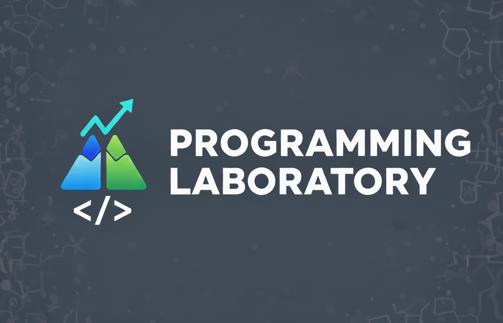

<div align="center">
  
</div>

# Programming Laboratory

[](https://www.python.org/downloads/)
[](https://nodejs.org/)
[](https://www.typescriptlang.org/)
[](LICENSE)
[](https://github.com/LucasBiason/programming-lab)

> **Laboratório de Programação Completo**  
> Um repositório consolidando cursos, tutoriais, experimentos e projetos de aprendizado em diversas áreas tecnológicas.

## 🎯 Objetivo do Projeto

Este repositório serve como um **laboratório de aprendizado** onde projetos experimentais, tutoriais e materiais de estudo são organizados. Quando os conceitos amadurecem, eles se tornam projetos independentes ou são movidos para bases de conhecimento especializadas:

- **Projetos IA/ML** → `ia-ml-knowledge-base`
- **Padrões de arquitetura** → `microservices-knowledge-base`
- **Outros tópicos especializados** → respectivas bases de conhecimento

## 📁 Estrutura do Projeto

```
programming-lab/
├── python/              # Python projects and tutorials
│   ├── frameworks/      # Django, Flask, Streamlit
│   │   ├── django/      # Django REST, JWT auth, CI/CD
│   │   ├── flask/       # Flask web apps, REST APIs
│   │   └── streamlit/   # Streamlit dashboards
│   ├── patterns/        # Design patterns
│   │   └── design-patterns/  # Design Patterns Python I & II
│   ├── testing/         # TDD, test doubles
│   │   ├── tdd/         # Test-Driven Development
│   │   └── test-doubles/ # Test doubles and mocks
│   ├── tools/           # Development tools
│   │   └── environments/ # Virtual environments (pipenv, Docker, ASDF)
│   └── api-integrations/ # API integrations
│       └── APIBancoCentral/
├── nodejs/              # Node.js projects and tutorials
│   ├── fundamentals/    # Basic Node.js, REST APIs
│   ├── typescript/      # TypeScript projects and setup
│   ├── graphql/         # GraphQL implementations
│   ├── react/           # React projects and hooks
│   ├── nextjs/          # Next.js projects
│   ├── orm/             # ORM examples (TypeORM)
│   └── infrastructure/  # Docker, Kafka, Redis, uploads
├── artificial-intelligence/  # AI/ML experiments
│   ├── tools/               # AI tools and integrations
│   │   ├── chatbots/        # OpenAI chatbots
│   │   ├── dashboards/      # AI-powered dashboards
│   │   ├── ocr/             # Optical Character Recognition
│   │   ├── langchain/       # LangChain experiments
│   │   ├── audio/           # Audio generation
│   │   └── ml-basics/        # Basic ML projects
│   ├── formations/          # Course materials
│   │   ├── fiap/            # POS FIAP IA para Devs
│   │   ├── udemy/           # Udemy formations
│   │   └── alura/           # Alura formations
│   └── projects/             # Mature projects
│       └── Projetos Construidos/  # Imobiliaria, NoMoreSpams, Telegram
├── architecture/        # Architecture patterns
│   └── cqrs-events/     # CQRS and event sourcing (complete implementation)
└── docs/                # Documentation
    ├── catalog/         # Project catalog
    └── migration/       # Migration notes
```

## 📊 Estatísticas

- **Total de Projetos**: ~36+ projetos migrados
- **Projetos Python**: 18+ projetos
- **Projetos Node.js**: 15+ projetos
- **Projetos IA/ML**: 11+ projetos
- **Projetos de Arquitetura**: 1 projeto complexo (CQRS)

## 🚀 Navegação Rápida

- [Projetos Python](./python/README.md)
- [Projetos Node.js](./nodejs/README.md)
- [Projetos IA/ML](./artificial-intelligence/README.md)
- [Padrões de Arquitetura](./architecture/README.md)
- [Catálogo Completo](./docs/catalog/CATALOGO_PROJETOS.md)

## 📚 Categorias

### Projetos de Aprendizado
Projetos criados ao seguir cursos, tutoriais ou aprender novos conceitos.

### Experimentos
Proofs of concept, testes e código experimental.

### Tutoriais
Implementações passo a passo de tutoriais e cursos.

### Materiais de Estudo
Notas, notebooks e recursos de aprendizado.

## 🔄 Migração de Repositórios Antigos

Este repositório consolida conteúdo de:
- `IA-Studies` - Projetos e experimentos IA/ML
- `Python-Studies` - Cursos e projetos Python
- `Nodejs-Studies` - Tutoriais e exemplos Node.js
- `CQRS-Events-in-Node.js` - Implementação de padrão de arquitetura

Veja `docs/catalog/` para o catálogo completo de projetos.

## 🎯 Princípios de Organização

1. **Por Tecnologia**: Projetos organizados por linguagem/framework
2. **Por Propósito**: Aprendizado, experimentação ou referência
3. **Natureza Temporária**: Projetos permanecem aqui até amadurecerem
4. **Caminho de Migração**: Caminho claro para bases de conhecimento quando pronto

## 🛠️ Stack Utilizada

### Tecnologias Principais
- **Python 3.9+** - Linguagem principal para projetos Python
- **Node.js 18+** - Runtime para projetos JavaScript/TypeScript
- **TypeScript 5.0+** - Superset do JavaScript com tipagem
- **Docker & Docker Compose** - Containerização
- **PostgreSQL** - Banco de dados (em alguns projetos)
- **Redis** - Cache e filas (em alguns projetos)

### Frameworks e Bibliotecas
- **Django/Flask** - Frameworks web Python
- **Express.js** - Framework web Node.js
- **React/Next.js** - Frameworks frontend
- **GraphQL** - Query language para APIs
- **TypeORM** - ORM para TypeScript/Node.js

### IA/ML
- **scikit-learn** - Algoritmos de ML
- **TensorFlow/PyTorch** - Deep Learning
- **LangChain** - Framework para LLMs
- **OpenAI API** - Integração com GPT

## 📝 Licença

Este projeto está licenciado sob a Licença MIT - veja o arquivo [LICENSE](LICENSE) para detalhes.

---

**Nota**: Este repositório está em organização ativa. A estrutura pode mudar conforme os projetos são migrados e organizados.

*Desenvolvido com ❤️ por Lucas Biason para consolidar conhecimentos e criar um laboratório de aprendizado completo.*

