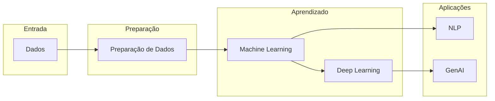

# Aula 1 - Introdução e História

**Fase 1 - IA para Devs** | **Seção 1 - Fundamentos de Inteligência Artificial**

---

## 📝 Resumo Executivo

- **Objetivo:** Introduzir a Inteligência Artificial desde suas raízes históricas (Alan Turing) até as abordagens atuais (ML, Deep Learning, NLP, GenAI), preparando o terreno para o restante do curso.
- **Principais conceitos:** Definição e evolução da IA; preparação de dados; Machine Learning; Deep Learning (CNNs, RNNs); Processamento de Linguagem Natural; Inteligência Artificial Generativa.
- **O que você vai ver:** Histórico da IA, sistemas baseados em regras vs. redes neurais, ecossistema de variantes (especializações e modelos de propósito geral), e a passagem da análise à criação (GenAI).

---

## A fundação da Inteligência Artificial

Em sua essência, a IA busca **imitar a capacidade humana de raciocínio, aprendizado e tomada de decisões**. Evoluiu de conceitos abstratos para aplicações práticas no dia a dia.

**Marcos históricos:** Desde os pioneiros como **Alan Turing** (teste da máquina, fundamentos da computação), passando pelo surgimento do termo "Inteligência Artificial" e dos primeiros sistemas de regras, até a revolução do **Aprendizado Profundo** (redes neurais profundas, grandes volumes de dados e poder de processamento). A trajetória da IA é marcada por invernos e renascimentos: avanços em redes neurais (décadas de 1980–1990, com backpropagation), depois limitações práticas, e a retomada com big data e GPUs a partir dos anos 2000.

---

## Preparando os alicerces: preparação de dados

Antes de criar, prever ou decidir, a IA precisa de uma **base sólida de dados**. A preparação de dados é o estágio crucial que antecede todos os avanços: desde a **coleta** até a **limpeza** e o **pré-processamento**, cada passo assegura que os dados estejam prontos para serem interpretados pela máquina. Inclui seleção de fontes, tratamento de **dados ausentes**, **outliers** e construção de conjuntos **representativos**. A preparação não é apenas um passo técnico, mas um ritual que define a qualidade e a eficácia de qualquer empreendimento em IA — dados mal preparados levam a modelos enviesados ou inúteis.

---

## A sinergia do Machine Learning

Com os dados prontos, entramos no **Machine Learning**, a espinha dorsal da IA. É o ponto em que algoritmos **aprendem padrões a partir dos dados** e se tornam capazes de realizar tarefas sem serem explicitamente programados para cada caso. Dos algoritmos fundamentais — **regressão linear**, **árvores de decisão** — aos mais complexos — **máquinas de vetores de suporte (SVM)** e **redes neurais** —, cada método é uma ferramenta na caixa da IA. O aprofundamento em **treinamento**, **avaliação** e **métricas** (precisão, recall, F1, RMSE etc.) determina a eficácia de um modelo preditivo ou classificador e evita overfitting ou underfitting.

---

## Deep Learning: neurônios e arquiteturas complexas

Quando o Machine Learning atinge seus limites em complexidade e capacidade de aprendizado, entra em cena o **Deep Learning**. Inspirado no funcionamento do cérebro humano, utiliza **redes neurais** com muitas **camadas** para analisar dados de maneira mais profunda. Arquiteturas como **CNNs** (redes neurais convolucionais) revolucionaram o **reconhecimento de imagem**; **RNNs** (redes recorrentes) brilham em **sequências**, **tradução automática** e processamento de linguagem. Nesse estágio, a IA não apenas aprende, mas **interpreta** — revelando padrões que seriam difíceis de capturar com modelos mais simples.

---

## Processamento de Linguagem Natural (NLP)

O **NLP** é a disciplina que capacita as máquinas a **entender e interagir com a linguagem humana**. Das técnicas básicas — **tokenização**, construção de **vocabulários**, representações vetoriais — aos modelos avançados (**BERT**, **GPT** e variantes), a IA passa a compreender **nuances**, **contexto** e **sentimentos** expressos em texto. Aplicações incluem **chatbots**, **análise de sentimentos**, sumarização, tradução e mineração de grandes volumes de dados textuais.

---

## Inteligência Artificial Generativa (GenAI)

Na **Inteligência Artificial Generativa (GenAI)**, a máquina não apenas analisa dados existentes, mas **cria conteúdo original e inspirador**. Com **redes neurais generativas** (incluindo **GANs** — redes adversariais generativas — e modelos autoregressivos como GPT), a IA gera imagens, músicas, textos e até simula realidades. É o ponto culminante onde **criatividade** e IA convergem, redefinindo não apenas o que a máquina pode fazer, mas como ela pode **cocriar** com as pessoas — com impactos em arte, design, educação e entretenimento, além de desafios éticos (deepfakes, autoria).

---

## 🧠 Conceitos-Chave (flashcards)

| P                                      | R                                                                                                                                  |
| -------------------------------------- | ---------------------------------------------------------------------------------------------------------------------------------- |
| O que é IA?                            | Campo que busca imitar raciocínio, aprendizado e tomada de decisões humanas; evoluiu de conceitos abstratos a aplicações práticas. |
| Por que a preparação de dados importa? | É o estágio que define a qualidade e eficácia do projeto; inclui coleta, limpeza, tratamento de ausentes e outliers.               |
| O que é Machine Learning?              | Algoritmos que aprendem padrões a partir de dados e realizam tarefas sem programação explícita para cada caso.                     |
| O que é Deep Learning?                 | Redes neurais com muitas camadas (ex.: CNNs, RNNs) para análise mais profunda; inspirado no cérebro.                               |
| O que é NLP?                           | Disciplina que permite às máquinas entender e interagir com a linguagem humana (ex.: BERT, GPT).                                   |
| O que é GenAI?                         | IA que gera conteúdo original (imagens, texto, áudio) em vez de apenas analisar dados existentes.                                  |

---

## 🗺️ Mapa conceitual

```
Inteligência Artificial (Introdução e História)
├── Fundação e essência
│   ├── Definição (raciocínio, aprendizado, decisão)
│   └── Evolução (Turing → hoje)
├── Preparação de dados
│   ├── Coleta e limpeza
│   └── Pré-processamento e representatividade
├── Machine Learning
│   ├── Algoritmos (regressão, árvores, SVM, redes)
│   └── Treinamento e métricas
├── Deep Learning
│   ├── CNNs (visão)
│   └── RNNs (sequências)
├── NLP
│   ├── Tokenização e vocabulários
│   └── Modelos (BERT, GPT)
└── GenAI
    └── Criação de conteúdo (imagem, texto, áudio)
```

---

## 📊 Diagrama – Ecossistema da IA



---

## 🧪 Receita prática – Roteiro de estudo desta aula

1. **Visão geral:** Ler o resumo executivo e o mapa conceitual para fixar a ordem dos temas (dados → ML → DL → NLP → GenAI).
2. **Fundação:** Fixar definição de IA e marcos históricos (Turing, backpropagation, big data, Deep Learning).
3. **Pipeline:** Entender por que a preparação de dados vem antes do ML e como cada camada (ML, DL, NLP, GenAI) se apoia na anterior.
4. **Conceitos:** Revisar os flashcards (IA, preparação de dados, ML, DL, NLP, GenAI) e responder às perguntas de reforço.
5. **Aprofundar:** Revisar o diagrama do ecossistema da IA e, se possível, explorar um caso prático (ex.: pipeline de um chatbot ou de um gerador de imagens).

---

## ❓ Perguntas para teste de reforço

1. O que a IA busca imitar? **R:** A capacidade humana de raciocínio, aprendizado e tomada de decisões.
2. Qual o papel da preparação de dados? **R:** Garantir base sólida (coleta, limpeza, pré-processamento) antes de treinar modelos.
3. Como o ML se diferencia de programação tradicional? **R:** Algoritmos aprendem padrões nos dados em vez de serem explicitamente programados para cada caso.
4. O que são CNNs e RNNs? **R:** CNNs para visão; RNNs para sequências (ex.: texto, tradução).
5. O que é GenAI? **R:** IA que gera conteúdo novo (imagem, texto, áudio) em vez de só analisar.
6. Cite um marco histórico da IA. **R:** Alan Turing; revolução do Aprendizado Profundo.

---

## 📎 Materiais de apoio

- **Referências:** BRETHENOUX (Gartner); Ferreira, _Inteligência Artificial_ (LTC); Harrison, _Machine Learning_ (Novatec); Taulli, _Introdução à IA_ (Novatec).
