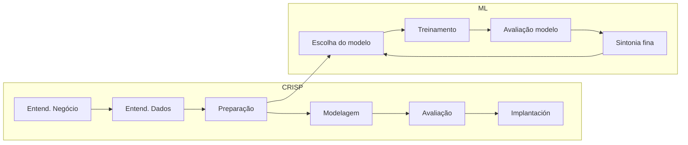

# Aula 2 - Dados e Machine Learning

**Fase 1 - IA para Devs** | **Seção 1 - Fundamentos de Inteligência Artificial**

---

## Resumo executivo

Esta aula conecta **dados** e **Machine Learning**: tipos de dados (estruturados, não estruturados, semi estruturados, séries temporais), o ecossistema **Big Data** (Volume, Velocidade, Variedade, Veracidade, Valor), ferramentas como **Hadoop** e **Lucene**, o processo **CRISP-DM** para mineração de dados, técnicas de **limpeza e preparação** e, por fim, os **tipos de aprendizado** (supervisionado, não supervisionado, reforço, semissupervisionado) e **algoritmos** principais (Naive Bayes, K-NN, regressão linear, árvore de decisão, clustering). Ao final, você terá uma visão clara de como os dados alimentam o ML e de como escolher modelo e pipeline.

**Objetivos de aprendizagem:**

- Identificar e classificar tipos de dados (estruturado, não estruturado, semi estruturado, séries temporais).
- Compreender os “Vs” do Big Data e o papel do Hadoop (HDFS, MapReduce) e do Lucene (indexação e busca).
- Aplicar as fases do CRISP-DM (entendimento do negócio, dos dados, preparação, modelagem, avaliação, implantação).
- Executar passos de limpeza (consistência, deduplicação, outliers, validação, one-hot, ETL).
- Diferenciar aprendizado supervisionado, não supervisionado, por reforço e semissupervisionado.
- Conhecer algoritmos: Naive Bayes, K-NN, regressão linear, árvore de decisão, clustering (K-means).
- Entender o fluxo típico: ordenação dos dados → escolha do modelo → treinamento → avaliação → sintonia fina.

---

## Conceitos-chave (flashcards)

**P:** O que são dados estruturados?  
**R:** Dados organizados em tabelas (linhas e colunas), com modelo definido (ex.: banco relacional). Ex.: planilhas de vendas, cadastro de clientes, transações financeiras.

**P:** O que são dados não estruturados?  
**R:** Informações sem formato fixo: texto livre, imagens, vídeos, áudio. Ex.: posts em redes sociais, relatórios em texto, fotos, podcasts.

**P:** O que são dados semi estruturados?  
**R:** Meio-termo: não cabem em tabelas rígidas, mas têm marcações (tags). Ex.: JSON, XML, HTML, e-mails (cabeçalho estruturado + corpo livre).

**P:** O que são séries temporais?  
**R:** Pontos de dados coletados em intervalos regulares no tempo, com carimbo de tempo. Ex.: temperatura hora a hora, cotações de ações, tráfego a cada 15 minutos.

**P:** O que são os “Vs” do Big Data?  
**R:** Volume (quantidade), Velocidade (geração e processamento em tempo quase real), Variedade (tipos diversos), Veracidade (qualidade e confiabilidade), Valor (extrair insights úteis).

**P:** O que é o CRISP-DM?  
**R:** Processo em seis fases para mineração de dados: Entendimento do Negócio, Entendimento dos Dados, Preparação dos Dados, Modelagem, Avaliação, Implantação.

**P:** Qual a diferença entre aprendizado supervisionado e não supervisionado?  
**R:** Supervisionado: dados com rótulos (entrada + saída desejada); o modelo aprende a prever/classificar. Não supervisionado: sem rótulos; o modelo descobre padrões, grupos ou anomalias.

**P:** O que é aprendizado por reforço?  
**R:** O agente aprende por tentativa e erro, recebendo recompensas (ou penalidades) conforme suas ações em um ambiente (ex.: jogos, robótica, recomendação).

**P:** Para que serve o Naive Bayes?  
**R:** Classificação probabilística assumindo independência entre atributos dada a classe. Muito usado em filtro de spam e análise de sentimento.

**P:** Como funciona o K-NN?  
**R:** Classifica uma amostra pela classe majoritária entre os K vizinhos mais próximos no espaço de características (distância, ex.: euclidiana). Aprendizado “preguiçoso”: a decisão é feita no momento da classificação.

---

## Tipos de dados e Big Data

### Tipos de dados

- **Estruturados:** tabelas, bancos relacionais; fácil consulta e modelagem (ex.: vendas, clientes).
- **Não estruturados:** texto, imagem, áudio, vídeo; exigem pré-processamento e modelos específicos (NLP, visão).
- **Semi estruturados:** JSON, XML, HTML; permitem parse por tags e ainda assim flexibilidade.
- **Séries temporais:** dados indexados no tempo; ideais para previsão (demanda, clima, ações).

### Big Data e os Vs

- **Volume:** quantidade massiva de dados (transações, IoT, redes sociais).
- **Velocidade:** dados gerados e que precisam ser processados em alta taxa (streaming).
- **Variedade:** mistura de formatos (estruturado + não estruturado).
- **Veracidade:** qualidade, precisão e confiabilidade; dados ruins levam a decisões erradas.
- **Valor:** capacidade de transformar dados em decisões e resultados de negócio.

### Hadoop e Lucene

**Hadoop** (inspirado em GFS e MapReduce do Google):

- **HDFS:** armazena arquivos em blocos distribuídos e replicados em vários nós.
- **MapReduce:** fase Map processa partes dos dados em paralelo (ex.: contagem de palavras); fase Reduce agrega os resultados (ex.: soma por palavra).

**Lucene:** biblioteca de indexação e busca de texto. Cria **índice invertido** (token → lista de documentos); usa **Analyzer** para tokenização e normalização; ranking por TF-IDF e outros fatores. Base de sistemas como Elasticsearch e Solr.

---

## Processo e preparação de dados

### CRISP-DM (resumo das fases)

1. **Entendimento do Negócio:** objetivos, requisitos e critérios de sucesso do ponto de vista do negócio.
2. **Entendimento dos Dados:** coleta, exploração, qualidade e primeiros insights.
3. **Preparação dos Dados:** seleção, limpeza, transformação e construção do dataset final.
4. **Modelagem:** escolha e aplicação de técnicas (vários modelos podem ser testados).
5. **Avaliação:** verificar se o modelo atende aos objetivos de negócio.
6. **Implantação:** colocar o modelo em uso (relatórios, APIs, processos).

Exemplo: previsão de demanda em varejo — desde o objetivo de estoque até a implantação do modelo no sistema de compras.

### Limpeza de dados (passos típicos)

- **Consistência:** mesmo formato (datas, fusos, unidades).
- **Deduplicação:** remover registros duplicados.
- **Outliers:** identificar e tratar (remover ou ajustar) com métodos estatísticos.
- **Regras de validação:** limites, tipos e integridade.
- **Armazenamento:** guardar dados limpos em formato adequado para análise.
- **Trivialidade:** remover campos irrelevantes.
- **Fusão/ETL:** combinar fontes (Extract, Transform, Load).
- **Codificação one-hot:** transformar categorias em colunas binárias para ML.
- **Tabelas de conversão:** padronizar códigos e nomes.

---

## Machine Learning: tipos de aprendizado e fluxo

O ML é análogo ao aprendizado por experiência: o algoritmo ajusta parâmetros (ou “pesos”) a partir dos dados. **Estatística útil:** desvio padrão (dispersão), distribuição normal, Teorema de Bayes (probabilidade condicional), correlação, extração de características (PCA, seleção de atributos).

### Tipos de aprendizado

| Tipo                | Dados                                 | Objetivo principal                               |
| ------------------- | ------------------------------------- | ------------------------------------------------ |
| Supervisionado      | Rotulados                             | Prever classe ou valor (classificação/regressão) |
| Não supervisionado  | Sem rótulos                           | Agrupar, reduzir dimensão, detectar anomalias    |
| Reforço             | Ambiente                              | Maximizar recompensa ao longo do tempo           |
| Semissupervisionado | Poucos rótulos + muitos não rotulados | Aprender com pouco rótulo                        |

**Fluxo típico de um projeto ML:** (1) Ordenação/preparação dos dados → (2) Escolha do modelo → (3) Treinamento → (4) Avaliação (dados não vistos) → (5) Sintonia fina (hiperparâmetros, mais dados, features).

---

## Principais algoritmos

**Naive Bayes:** usa Teorema de Bayes e independência entre atributos dada a classe. Rápido, poucos dados; bom para texto (spam, sentimento). Limitação: correlações fortes entre atributos podem prejudicar.

**K-NN (K-Nearest Neighbor):** classificação (ou regressão) pela maioria (ou média) dos K vizinhos mais próximos. Simples, sem treinamento pesado; sensível à escolha de K e ao desbalanceamento de classes.

**Regressão linear:** modela relação linear entre variáveis; equação tipo \(y = mx + b\). Interpretável (coeficientes); pressupõe relação linear e erros com variância constante. Base para regressão múltipla.

**Árvore de decisão:** divisões sucessivas por atributos (ganho de informação, Gini); nós de decisão e folhas com previsão. Muito interpretável; risco de overfitting (poda, florestas).

**Clustering (ex.: K-means):** agrupa pontos por similaridade (ex.: distância); K clusters, centros atualizados iterativamente. Útil para segmentação sem rótulos; número de clusters e escala dos dados importam.

---

## Mapa conceitual

```
Dados e Machine Learning
├── Tipos de dados
│   ├── Estruturados (tabelas, BD)
│   ├── Não estruturados (texto, imagem, áudio)
│   ├── Semi estruturados (JSON, XML)
│   └── Séries temporais (timestamp)
├── Big Data
│   ├── Vs: Volume, Velocidade, Variedade, Veracidade, Valor
│   ├── Hadoop (HDFS, MapReduce)
│   └── Lucene (índice invertido, busca)
├── Processo
│   ├── CRISP-DM (6 fases)
│   └── Limpeza (consistência, dedup, outliers, ETL, one-hot…)
├── Tipos de aprendizado
│   ├── Supervisionado
│   ├── Não supervisionado
│   ├── Reforço
│   └── Semissupervisionado
└── Algoritmos
    ├── Naive Bayes, K-NN
    ├── Regressão linear
    ├── Árvore de decisão
    └── Clustering (K-means)
```

---

## Diagrama – Fluxo CRISP-DM e pipeline ML



---

## Receita prática – Do dado ao modelo

1. **Definir objetivo:** o que o negócio precisa (prever, classificar, segmentar)?
2. **Coletar e explorar:** tipos de dados, qualidade, missing, outliers.
3. **Preparar:** limpeza (CRISP-DM fase 3), codificação (one-hot se necessário), train/test split.
4. **Escolher tipo de aprendizado:** rótulos disponíveis? → supervisionado; só padrões? → não supervisionado; ambiente interativo? → reforço.
5. **Escolher algoritmo:** classificação binária/multiclasse → Naive Bayes, árvore, K-NN; regressão → regressão linear; agrupamento → K-means.
6. **Treinar e avaliar:** métricas (acurácia, precisão, recall, RMSE etc.) em dados de teste.
7. **Ajustar e implantar:** sintonia fina e deploy do modelo escolhido.

---

## Caso em destaque: Stitch Fix

A **Stitch Fix** combina estilistas humanos com algoritmos de ML: questionários dos clientes e dados de compras alimentam modelos que preveem peças que o cliente tende a gostar. O sistema usa feedback contínuo (loop) e também ajuda em tendências e estoque. Exemplo de uso de dados + ML para personalização em varejo.

---

## Perguntas para teste de reforço

1. Dê um exemplo de dado estruturado e um de não estruturado. **R:** Estruturado: planilha de vendas. Não estruturado: post no Twitter ou imagem.
2. O que é MapReduce? **R:** Modelo de processamento em duas fases: Map (processamento paralelo em partes dos dados) e Reduce (agregação dos resultados).
3. Cite três fases do CRISP-DM. **R:** Ex.: Entendimento do Negócio, Preparação dos Dados, Modelagem.
4. Para que serve codificação one-hot? **R:** Transformar variáveis categóricas em colunas binárias para algoritmos de ML que não usam categorias diretamente.
5. Quando usar aprendizado não supervisionado? **R:** Quando não há rótulos e o objetivo é descobrir grupos, padrões ou anomalias.
6. O que o Naive Bayes assume sobre os atributos? **R:** Independência entre os atributos dada a classe.
7. No K-NN, o que significa K? **R:** Número de vizinhos mais próximos usados para decidir a classe (ou valor) da amostra.
8. Qual vantagem da árvore de decisão? **R:** Interpretabilidade: é possível explicar o caminho da raiz até a folha para cada previsão.
9. O que é clustering? **R:** Agrupar dados por similaridade sem usar rótulos (aprendizado não supervisionado).
10. O que a Stitch Fix faz com IA? **R:** Usa algoritmos para personalizar seleção de roupas com base em questionário e histórico, com refinamento contínuo por feedback.

---

## Materiais de apoio

- Apache Hadoop: [hadoop.apache.org](https://hadoop.apache.org)
- Apache Lucene: [lucene.apache.org](https://lucene.apache.org)
- CRISP-DM: documentação e guias do processo (consulte referências oficiais do consórcio).
- Scikit-learn: [scikit-learn.org](https://scikit-learn.org) (implementações dos algoritmos e tutoriais).
