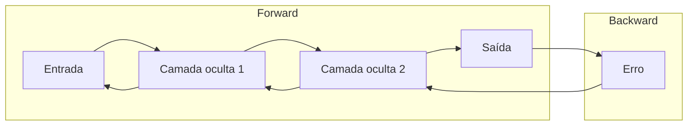

# Aula 3 - Deep Learning

**Fase 1 - IA para Devs** | **Seção 1 - Fundamentos de Inteligência Artificial**

---

## Resumo executivo

Esta aula explora **Deep Learning (DL)**: a comparação entre cérebro humano e redes neurais artificiais, a **história das RNAs** (McCulloch-Pitts, Perceptron, backpropagation), o funcionamento de **redes feedforward** e do algoritmo de **retropropagação**, e os tipos **RNN** (sequências, NLP, fala, séries temporais) e **CNN** (imagens, visão computacional). Inclui aplicações (Alzheimer, data centers Google, terremotos, radiologia), **hardware** (GPUs, TPU, Inferentia, FPGAs, ASICs) e **limitações** do DL (dados, interpretabilidade, generalização, custo, viés). Ao final, você entende por que o DL é “inspirado no cérebro” e quando usá-lo.

**Objetivos de aprendizagem:**

- Comparar neurônios biológicos e artificiais (sinapses vs pesos, plasticidade vs backpropagation).
- Descrever a evolução: McCulloch-Pitts, Perceptron, backpropagation (Rumelhart, Hinton, Williams).
- Explicar redes feedforward e o papel da retropropagação do erro.
- Diferenciar RNN (memória, sequências) e CNN (convolução, pooling, visão).
- Identificar aplicações de DL (saúde, energia, sismologia, radiologia).
- Conhecer hardware para treinamento e inferência (NVIDIA, TPU, Inferentia, etc.).
- Listar desvantagens do DL (dados, caixa-preta, generalização, custo, viés).

---

## Conceitos-chave (flashcards)

**P:** Em que o cérebro e o Deep Learning se assemelham?  
**R:** Ambos usam unidades de processamento conectadas (neurônios vs perceptrons), processamento paralelo e distribuído, e aprendizado por ajuste de conexões (sinapses vs pesos).

**P:** O que é backpropagation?  
**R:** Algoritmo que propaga o erro da saída de volta pelas camadas da rede, ajustando os pesos para minimizar o erro. Permite treinar redes com várias camadas.

**P:** O que é uma rede feedforward?  
**R:** Rede em que a informação flui em uma única direção (entrada → camadas ocultas → saída), sem ciclos. Exemplo clássico: classificação de dígitos manuscritos.

**P:** Para que servem as RNNs?  
**R:** Processar **sequências** (texto, áudio, séries temporais); mantêm um estado/memória e usam saídas anteriores como entrada. Usadas em tradução, reconhecimento de fala, previsão financeira.

**P:** Para que servem as CNNs?  
**R:** Processar dados em **grade** (principalmente imagens): convolução extrai características (bordas, texturas), pooling reduz dimensão, camadas densas classificam. Usadas em reconhecimento facial, diagnóstico por imagem, veículos autônomos.

**P:** O que é o Amazon Inferentia?  
**R:** Chip da AWS otimizado para **inferência** de ML (uso do modelo já treinado), com foco em desempenho e custo em comparação a GPUs.

**P:** Cite uma desvantagem do Deep Learning.  
**R:** Ex.: dependência de grandes volumes de dados; modelos “caixa-preta” (pouca interpretabilidade); dificuldade de generalizar para contextos fora do treino; alto custo computacional e energético; risco de amplificar viés dos dados.

**P:** O que é o Transformer (Google)?  
**R:** Arquitetura de rede (2017) baseada em **mecanismo de atenção**, processando sequências em paralelo (não passo a passo como RNN). Base para BERT, GPT, T5 e muitos modelos de linguagem e visão.

---

## Cérebro humano x Deep Learning

- **Neurônios e unidades:** no cérebro, neurônios comunicam por sinapses; no DL, unidades (perceptrons) têm pesos nas conexões. Ambos se adaptam: plasticidade sináptica vs ajuste de pesos (backpropagation).
- **Paralelismo:** o cérebro tem regiões especializadas (visão, audição); redes profundas têm camadas que aprendem níveis de abstração (bordas → texturas → objetos).
- **Aprendizado:** experiência reforça caminhos neurais; em DL, o erro guia o ajuste dos pesos.
- **Limitação do DL:** o cérebro é muito mais eficiente em energia e flexibilidade; o DL exige muitos dados e muito poder de processamento.

---

## História das redes neurais artificiais

- **1943 – McCulloch e Pitts:** modelo matemático simplificado de neurônio (cálculos básicos).
- **1950–1960 – Perceptron (Rosenblatt):** algoritmo de aprendizado; limitação: não resolve problemas não lineares.
- **1980 – Backpropagation (Rumelhart, Hinton, Williams):** permite treinar redes com várias camadas, ajustando pesos a partir do erro. Abre caminho para redes profundas.

---

## Redes feedforward e backpropagation

Em uma **rede feedforward**, os dados passam da entrada às camadas ocultas e à saída, sem ciclos. Cada neurônio aplica uma função de ativação à soma ponderada das entradas.

O **backpropagation** funciona assim: (1) uma entrada é processada e produz uma saída; (2) a saída é comparada ao valor desejado, gerando um erro; (3) o erro é propagado **de trás para frente** pelas camadas; (4) os pesos de cada conexão são atualizados para reduzir esse erro. Exemplo: rede que distingue gato de cachorro; se classifica gato como cachorro, o erro é propagado e os pesos são ajustados para melhorar a distinção.

---

## RNN e CNN

### Rede neural recorrente (RNN)

- **Ideia:** conexões em loop; a saída de um passo pode ser usada como entrada no próximo (estado/memória).
- **Uso:** sequências — texto, fala, séries temporais.
- **Exemplos:** tradução automática (Google Translate), reconhecimento de fala (Siri, Google Assistant), previsão de ações/índices.

### Rede neural convolucional (CNN)

- **Ideia:** **convolução** (filtros que detectam padrões locais, ex.: bordas), **pooling** (redução de dimensão preservando o essencial), depois camadas **densas** para classificação.
- **Uso:** imagens e dados em grade.
- **Exemplos:** reconhecimento de rostos (Facebook), diagnóstico por imagem (raios-X, ressonância), veículos autônomos (Tesla).

---

## Aplicações do Deep Learning

- **Alzheimer:** CNNs analisam imagens cerebrais (ressonância, tomografia) para detectar padrões iniciais e prever progressão.
- **Energia (Google):** DL prevê consumo e ajusta refrigeração de data centers em tempo real, reduzindo energia e emissões.
- **Terremotos:** redes analisam dados sísmicos para padrões de alerta e modelos de simulação.
- **Radiologia:** CNNs auxiliam em diagnóstico (câncer, fraturas, nódulos), complementando o trabalho do radiologista e aumentando eficiência.

---

## Hardware para Deep Learning

- **GPUs (NVIDIA):** processamento paralelo massivo; padrão em treinamento e inferência.
- **Google TPU:** chip para operações com tensores, otimizado para DL.
- **Amazon Inferentia:** focado em **inferência** (menor custo, alta throughput); compatível com TensorFlow, PyTorch, MXNet.
- **FPGAs:** programáveis pós-fabricação; usados em inferência customizada.
- **ASICs:** chips específicos (ex.: Apple Neural Engine em dispositivos móveis).

---

## Desvantagens do Deep Learning (Marcus e outros)

- Dependência de **grandes volumes de dados** (e muitas vezes anotados).
- **Pouca transparência:** modelos como “caixa-preta”.
- **Generalização e transferência** limitadas para contextos muito diferentes do treino.
- Dependência de **supervisão humana** (rótulos, curadoria).
- Dificuldade com **estrutura hierárquica** e raciocínio simbólico/abstrato.
- **Custo computacional** e energético alto.
- Pouca incorporação de **conhecimento prévio** e contexto explícito.
- Dificuldade com **raciocínio causal** (correlação ≠ causalidade).
- **Viés e discriminação** podem ser perpetuados ou amplificados pelos dados.
- Limitações em tarefas de **raciocínio complexo** e abstração.

---

## Mapa conceitual

```
Deep Learning
├── Inspiração biológica
│   ├── Neurônios ↔ unidades (pesos)
│   ├── Processamento paralelo e camadas
│   └── Limitações (dados, energia)
├── História
│   ├── McCulloch-Pitts, Perceptron
│   └── Backpropagation (Rumelhart, Hinton, Williams)
├── Arquiteturas
│   ├── Feedforward + backpropagation
│   ├── RNN (sequências, memória)
│   └── CNN (convolução, pooling, visão)
├── Aplicações
│   ├── Saúde (Alzheimer, radiologia)
│   ├── Energia, sismologia
│   └── Visão e linguagem (Transformer, BERT, GPT)
├── Hardware
│   ├── GPU, TPU, Inferentia, FPGA, ASIC
│   └── Treinamento vs inferência
└── Desvantagens
    ├── Dados, interpretabilidade, generalização
    └── Custo, viés, raciocínio causal
```

---

## Diagrama – Fluxo em rede feedforward e backpropagation



---

## Receita prática – Quando e como pensar em Deep Learning

1. **Tipo de dado:** imagens ou sequências (texto, áudio, tempo)? CNNs para imagens; RNNs ou Transformers para sequências.
2. **Volume de dados:** DL costuma precisar de muitos dados (e rótulos, no supervisionado). Poucos dados? Considerar modelos mais simples ou transfer learning.
3. **Objetivo:** classificação, detecção, segmentação, geração — escolher arquitetura e loss adequadas.
4. **Recursos:** treinamento pesado exige GPU/TPU ou nuvem; inferência pode usar chips dedicados (Inferentia, etc.).
5. **Interpretabilidade:** se precisar explicar decisões, considerar modelos mais interpretáveis ou técnicas de explicabilidade (ex.: attention, saliency).
6. **Riscos:** verificar viés, dados sensíveis e impacto ético antes de colocar em produção.

---

## Transformer e impacto

O **Transformer** (Google, 2017) substitui o processamento **sequencial** das RNNs pelo **mecanismo de atenção** (multi-head attention), permitindo processar sequências em paralelo e capturar dependências de longo alcance. Tornou-se base para **BERT** (encoder), **GPT** (decoder), **T5** e outros modelos de linguagem e visão, redefinindo o estado da arte em NLP e além.

---

## Perguntas para teste de reforço

1. Quem propôs o modelo inicial de neurônio artificial? **R:** McCulloch e Pitts (1943).
2. Qual limitação do Perceptron original? **R:** Não resolver problemas não lineares.
3. O que o backpropagation propaga pela rede? **R:** O erro (da saída em direção à entrada), para ajustar os pesos.
4. RNN é mais indicada para que tipo de dado? **R:** Sequências (texto, áudio, séries temporais).
5. CNN é mais indicada para que tipo de dado? **R:** Dados em grade, especialmente imagens.
6. Cite um uso de CNN na saúde. **R:** Diagnóstico por imagem (raios-X, ressonância), detecção de Alzheimer, nódulos.
7. O que é o Amazon Inferentia? **R:** Chip da AWS otimizado para inferência de ML.
8. Cite duas desvantagens do Deep Learning. **R:** Ex.: necessidade de muitos dados; modelos caixa-preta; custo computacional; risco de viés.
9. O que o Transformer introduziu de diferente em relação às RNNs? **R:** Mecanismo de atenção e processamento paralelo da sequência (não passo a passo).
10. O que é pooling em uma CNN? **R:** Operação que reduz a dimensão espacial dos mapas de características, preservando informações principais.

---

## Materiais de apoio

- Deep Learning (Goodfellow, Bengio, Courville): livro de referência.
- TensorFlow: [tensorflow.org](https://www.tensorflow.org)
- PyTorch: [pytorch.org](https://pytorch.org)
- Paper “Attention is All You Need” (Transformer): referência original da arquitetura.
