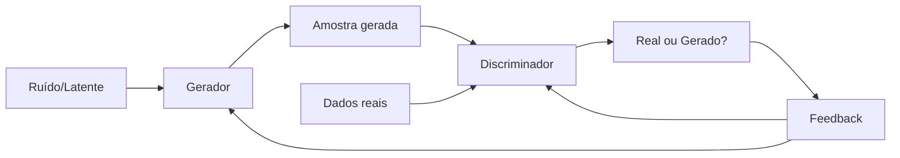

# Aula 4 - IA Generativa

**Fase 1 - IA para Devs** | **Seção 1 - Fundamentos de Inteligência Artificial**

---

## Resumo executivo

Esta aula aborda a **Inteligência Artificial Generativa (GenAI)** e as **GANs (Redes Adversariais Generativas)**. Inclui o contexto histórico (Turing, McCarthy, Perceptron, Deep Learning, Goodfellow 2014), os **componentes** de uma GAN (gerador e discriminador), o **treinamento adversarial** (equilíbrio de Nash), **aplicações** (arte, rostos sintéticos, deepfakes, medicina, moda) e **desafios éticos** (autenticidade, desinformação). Também menciona a evolução para modelos como **GPT-3** e o futuro da GenAI. Ao final, você entende como a IA não só analisa, mas **cria** conteúdo novo e quais são os trade-offs éticos e técnicos.

**Objetivos de aprendizagem:**

- Situar a GenAI na história da IA (anos 1950–1960 até GANs e GPT).
- Descrever os dois componentes de uma GAN (gerador e discriminador) e o papel de cada um.
- Explicar o processo de treinamento adversarial e o conceito de equilíbrio de Nash.
- Dar exemplos de aplicações (arte, rostos, deepfakes, dados sintéticos, moda).
- Reconhecer desafios éticos (deepfakes, veracidade, autoria).
- Relacionar GANs com outros modelos generativos (ex.: GPT) quando aplicável.

---

## Conceitos-chave (flashcards)

**P:** O que é IA generativa?  
**R:** IA que **gera** conteúdo novo (imagem, texto, áudio, vídeo) em vez de apenas classificar ou prever. Inclui GANs, modelos autoregressivos (GPT) e outros.

**P:** O que é uma GAN?  
**R:** Rede com dois componentes: um **gerador** (cria amostras, ex.: imagens) e um **discriminador** (distingue real vs gerado). Treinados de forma adversarial: um tenta enganar, o outro tenta acertar.

**P:** Qual o papel do gerador em uma GAN?  
**R:** Produz amostras (ex.: imagens) a partir de ruído ou latentes, com o objetivo de serem indistinguíveis dos dados reais.

**P:** Qual o papel do discriminador em uma GAN?  
**R:** Recebe dados reais e dados gerados e classifica cada um como “real” ou “gerado”. Funciona como juiz que o gerador tenta enganar.

**P:** O que é treinamento adversarial?  
**R:** Processo em que gerador e discriminador são treinados alternadamente: o discriminador melhora em distinguir; o gerador melhora em enganar. Tendem a um equilíbrio (ex.: equilíbrio de Nash).

**P:** O que é equilíbrio de Nash no contexto de GANs?  
**R:** Situação em que o discriminador não consegue distinguir real de gerado melhor que aleatório; o gerador produz amostras de qualidade tão alta que a discriminação fica impossível.

**P:** O que são deepfakes?  
**R:** Vídeos ou áudios gerados ou alterados por IA (muitas vezes com GANs) que imitam pessoas reais, levantando questões de autenticidade e desinformação.

**P:** Como a GenAI se relaciona com GPT?  
**R:** GPT é um modelo **generativo** de texto (autoregressivo): gera sequências de palavras. Não é GAN, mas faz parte do ecossistema GenAI (criação de conteúdo).

---

## História da IA generativa

- **1950–1960:** Turing, McCarthy e outros estabelecem bases da IA; visão de máquinas que “pensam”.
- **1958 – Perceptron (Rosenblatt):** um dos primeiros modelos de rede neural; marco para aprendizado de máquina.
- **Anos 1980–1990:** Renascença da IA; redes profundas e maior poder computacional; avanços em reconhecimento de padrões.
- **2006 – Deep Learning (Hinton):** redes neurais profundas ganham eficácia prática.
- **2014 – GANs (Ian Goodfellow):** gerador e discriminador em arranjo adversarial; geração de imagens, áudio e texto muito realistas.
- **Aplicações e impacto:** arte, música, modelos 3D, dados médicos sintéticos, moda virtual; surgem questões éticas (deepfakes).
- **Evolução recente:** modelos como **GPT-3** ampliam a geração de texto; GenAI em assistentes, criação de conteúdo e novas interfaces.

---

## Componentes de uma GAN

**Gerador (Generator)**

- Rede neural que **gera** novos dados (ex.: imagens).
- Entrada: vetor de ruído ou latente.
- Objetivo: produzir amostras que o discriminador classifique como “reais”.

**Discriminador (Discriminator)**

- Rede que **avalia** amostras.
- Entrada: dados reais ou gerados.
- Saída: probabilidade de ser “real” vs “gerado”.
- Objetivo: classificar corretamente, servindo de critério para o gerador melhorar.

---

## Processo de treinamento

1. **Treinamento do gerador:** gera amostras (no início, muitas vezes de baixa qualidade).
2. **Avaliação pelo discriminador:** recebe amostras reais e geradas e classifica cada uma.
3. **Feedback e ajustes:**
   - Se o discriminador acerta (detecta gerado) → o gerador é ajustado para melhorar.
   - Se o discriminador erra → o discriminador é ajustado para discriminar melhor.
4. **Dinâmica adversarial:** o gerador tenta “enganar”; o discriminador tenta não ser enganado. O ciclo continua até um equilíbrio em que a distinção fica muito difícil (equilíbrio de Nash).

---

## Aplicações e impacto

- **Arte e criatividade:** geração de imagens, estilos, música.
- **Rostos e avatares:** geração de rostos humanos que “nunca existiram”.
- **Deepfakes:** vídeos/áudios falsos mas convincentes; desafio para verificação e confiança.
- **Medicina:** dados sintéticos para treino e privacidade; geração de imagens médicas.
- **Moda e e-commerce:** modelos virtuais, roupas em avatares.
- **Entretenimento e educação:** conteúdo gerado para jogos, filmes, materiais didáticos.

---

## Desafios e considerações éticas

- **Autenticidade:** dificuldade de distinguir real de gerado; impacto em notícias, provas e identidade.
- **Desinformação:** deepfakes podem ser usados para manipulação e fraude.
- **Autoria e direitos:** quem é autor do conteúdo gerado? Uso de dados e obras para treino.
- **Viés:** modelos podem reproduzir e amplificar viés dos dados de treinamento.
- **Regulamentação e uso responsável:** necessidade de políticas, verificabilidade e transparência.

---

## Mapa conceitual

```
IA Generativa (GenAI)
├── Histórico
│   ├── Turing, McCarthy, Perceptron
│   ├── Deep Learning (Hinton)
│   ├── GANs (Goodfellow 2014)
│   └── GPT e modelos de linguagem
├── GANs
│   ├── Gerador (gera amostras)
│   ├── Discriminador (real vs gerado)
│   ├── Treinamento adversarial
│   └── Equilíbrio de Nash
├── Aplicações
│   ├── Arte, música, rostos
│   ├── Deepfakes, medicina, moda
│   └── Texto (GPT, assistentes)
└── Ética e desafios
    ├── Autenticidade, deepfakes
    ├── Autoria, viés
    └── Regulamentação
```

---

## Diagrama – GAN (gerador e discriminador)



---

## Receita prática – Entender e usar GenAI

1. **Objetivo:** gerar imagem, texto, áudio ou outro tipo de mídia? Isso define se você pensa em GAN, modelo de linguagem (GPT-style) ou outro arquitetura.
2. **GAN vs autoregressivo:** GANs são fortes em imagens (e alguns áudios); modelos como GPT são fortes em texto e podem ser usados para geração condicionada.
3. **Treinamento:** GANs exigem dados reais para o discriminador e cuidado com instabilidade (modo collapse, treino desbalanceado). Modelos pré-treinados (GPT, DALL·E, etc.) permitem uso com pouco ou sem treino.
4. **Ética:** verificar uso de dados, direitos autorais, possibilidade de deepfakes e impacto em terceiros antes de implantar ou divulgar conteúdo gerado.
5. **Validação:** onde for crítico (ex.: saúde, jurídico), manter supervisão humana e canais de verificação.

---

## Evolução além das GANs

Modelos como **GPT-3** (e sucessores) mostram que a GenAI não se limita a GANs: **modelos autoregressivos** de linguagem geram texto coerente e são usados em assistentes, resumos, código e criatividade. A combinação de **visão + linguagem** (ex.: DALL·E, Stable Diffusion) expande a geração para imagens a partir de texto. O campo continua evoluindo em arquiteturas, escala e aplicações, com foco crescente em alinhamento, segurança e explicabilidade.

---

## Perguntas para teste de reforço

1. Quem introduziu as GANs e em que ano? **R:** Ian Goodfellow, 2014.
2. Cite os dois componentes principais de uma GAN. **R:** Gerador e discriminador.
3. O que o gerador tenta fazer em relação ao discriminador? **R:** Produzir amostras que o discriminador classifique como “reais” (enganar o discriminador).
4. O que é equilíbrio de Nash no contexto de GANs? **R:** Situação em que o discriminador não consegue distinguir real de gerado de forma útil; o gerador atinge alta qualidade.
5. Dê um exemplo de aplicação positiva das GANs. **R:** Ex.: geração de arte, dados médicos sintéticos, modelos de moda virtual.
6. O que são deepfakes e qual o risco? **R:** Vídeos/áudios falsos gerados ou alterados por IA que imitam pessoas reais; risco de desinformação e fraude.
7. GPT-3 é uma GAN? **R:** Não; é um modelo generativo de linguagem (autoregressivo), não uma arquitetura adversarial.
8. Por que o treinamento de uma GAN é chamado “adversarial”? **R:** Porque gerador e discriminador têm objetivos opostos: um tenta enganar, o outro tenta distinguir.
9. Cite um desafio ético da IA generativa. **R:** Ex.: deepfakes e autenticidade; autoria do conteúdo gerado; viés; uso para desinformação.
10. O que o discriminador recebe como entrada? **R:** Amostras que podem ser reais (do dataset) ou geradas pelo gerador; ele classifica cada uma.

---

## Materiais de apoio

- Paper original das GANs: Goodfellow et al., “Generative Adversarial Networks” (2014).
- Recursos sobre ética em IA e deepfakes: institutos de pesquisa em IA responsável (ex.: OpenAI, Partnership on AI).
- Documentação de modelos de linguagem e ferramentas de geração: OpenAI, Hugging Face, etc.
