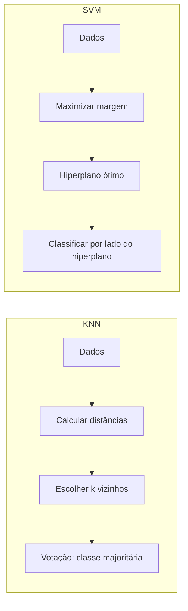

# Aula 2 - KNN, SVM

**Fase 1 - IA para Devs** | **Seção 4 - Machine Learning Avançado**

---

## Resumo executivo

Esta aula apresenta dois algoritmos de **classificação supervisionada**: **KNN (K-Nearest Neighbors)** e **SVM (Support Vector Machine)**. O KNN classifica com base na distância aos k vizinhos mais próximos; é não paramétrico e depende da escolha de k e da métrica de distância (Euclidiana, Manhattan, Minkowski). O SVM separa classes por **hiperplanos** maximizando a **margem** entre elas; usa o hiperparâmetro **C** para equilíbrio entre margem larga e violações (classificação de margem suave) e **kernels** (polinomial, RBF) para dados não linearmente separáveis. Ambos são sensíveis ao escalonamento das features; no Sklearn usa-se `KNeighborsClassifier` e `SVC`/`LinearSVC`.

**Objetivos de aprendizagem:**

- Entender o funcionamento do KNN (votação entre k vizinhos mais próximos) e como escolher k (otimização de hiperparâmetro; k baixo → overfitting, k alto → supersuavização).
- Conhecer métricas de distância: Euclidiana, Manhattan e outras no Sklearn.
- Compreender o SVM: margem máxima, reta que melhor separa os dados (maior distância aos pontos), e o papel de C (regularização).
- Aplicar SVM linear e não linear (kernel poly, RBF) no Sklearn com Pipeline.

---

## Conceitos-chave (flashcards)

**P:** O que é o algoritmo KNN?  
**R:** Algoritmo de classificação supervisionada que atribui a uma amostra a **classe majoritária** entre os **k vizinhos mais próximos** no espaço das features; é não paramétrico (não assume forma da função).

**P:** Como o KNN usa a distância?  
**R:** Mede a proximidade entre pontos (ex.: Euclidiana √((x₁−x₂)²+(y₁−y₂)²) ou Manhattan |x₁−x₂|+|y₁−y₂|); a classificação depende de qual métrica e de k (ex.: k=5 → vence a classe que aparecer mais entre os 5 mais próximos).

**P:** O que acontece se k for muito baixo ou muito alto no KNN?  
**R:** k muito baixo: overfitting (ruído domina). k muito alto: supersuavização (perde estrutura local). O melhor k costuma ser encontrado por validação (ex.: curva de erro para k=1 até 20; em geral k ímpar para evitar empate).

**P:** O que é o SVM e qual seu objetivo?  
**R:** Algoritmo de classificação que separa classes por **hiperplanos** maximizando a **margem** (distância entre o hiperplano e os pontos mais próximos de cada classe); quanto mais larga a margem, em geral melhor a generalização.

**P:** Para que serve o hiperparâmetro C no SVM?  
**R:** Controla o equilíbrio entre **margem larga** e **violações de margem**: C pequeno → margem mais larga, mais violações (modelo mais regularizado); C grande → menos violações, margem menor (risco de overfitting). Reduzir C regulariza.

**P:** Como o SVM lida com dados não linearmente separáveis?  
**R:** Usando **kernels** (ex.: polinomial `kernel="poly"`, RBF Gaussiano) que mapeiam os dados para um espaço de maior dimensão onde se torna possível separar com um hiperplano.

---

## Exemplos práticos

```python
# KNN - Sklearn (métrica padrão: Minkowski ~ Euclidiana)
from sklearn.neighbors import KNeighborsClassifier

modelo_classificador = KNeighborsClassifier(n_neighbors=5)
modelo_classificador.fit(x_train, y_train)
# Classificação com base nos 5 vizinhos mais próximos
```

```python
# Encontrar melhor k por erro de classificação (exemplo da aula)
import numpy as np
error = []
for i in range(1, 10):
    knn = KNeighborsClassifier(n_neighbors=i)
    knn.fit(x_train, y_train)
    pred_i = knn.predict(x_test_escalonado)
    error.append(np.mean(pred_i != y_test))
# Plotar error vs k para escolher o k com menor erro
```

```python
# SVM linear com Pipeline (Sklearn)
from sklearn.pipeline import Pipeline
from sklearn.svm import LinearSVC

svm = Pipeline([("linear_svc", LinearSVC(C=1))])
svm.fit(x_train, y_train)
```

```python
# SVM com kernel polinomial (dados não linearmente separáveis)
from sklearn.svm import SVC

poly_svm = Pipeline([
    ("svm", SVC(kernel="poly", degree=3, coef0=1, C=5))
])
poly_svm.fit(x_train, y_train)
```

---

## Mapa conceitual

```
KNN e SVM
├── KNN (K-Vizinhos mais próximos)
│   ├── Não paramétrico; votação entre k vizinhos
│   ├── Métricas: Euclidiana, Manhattan, Minkowski
│   ├── Escolha de k: validação; k ímpar comum (1–20)
│   └── Escalonamento das features importante
├── SVM (Support Vector Machine)
│   ├── Hiperplano; margem máxima
│   ├── C: trade-off margem vs violações (regularização)
│   ├── Linear (LinearSVC) e não linear (SVC + kernel)
│   └── Kernels: poly, RBF para dados não separáveis
└── Sklearn: KNeighborsClassifier, SVC, LinearSVC, Pipeline
```

---

## Receita prática

1. **Pré-processar:** escalonar features (SVM é sensível à escala; KNN também se usa distância).
2. **KNN:** escolher k (ex.: loop k=1..20, plotar erro em validação); usar `KNeighborsClassifier(n_neighbors=k)`, fit em x_train/y_train.
3. **SVM linear:** usar `LinearSVC(C=1)` ou Pipeline; ajustar C se overfitting (reduzir C).
4. **SVM não linear:** se dados não são linearmente separáveis, usar `SVC(kernel="poly", degree=3, C=5)` ou kernel RBF.
5. **Avaliar:** métricas de classificação (acurácia, precisão, recall, F1) em x_test/y_test.

---

## Diagrama (Mermaid)



---

## Perguntas para teste de reforço

1. O KNN é paramétrico ou não paramétrico? **R:** Não paramétrico; não assume forma da função que relaciona features ao target.
2. Qual a diferença entre distância Euclidiana e Manhattan? **R:** Euclidiana: “em linha reta” (hipotenusa). Manhattan: soma dos catetos (como quarteirões); ambas medem proximidade entre dois pontos.
3. Por que a “melhor reta” no SVM é a que tem margem maior? **R:** Margem maior tende a generalizar melhor e a ser mais estável ante novos pontos (menos sensível a pequenas variações).
4. O que o parâmetro C alto faz no SVM? **R:** C alto prioriza menos violações de margem e margem mais estreita, podendo levar a overfitting.
5. Para dados que não podem ser separados por uma reta, o que usar no SVM? **R:** Kernel não linear (polinomial ou RBF) para mapear os dados a um espaço onde um hiperplano separa as classes.

---

## Materiais de apoio

- Scikit-learn – KNeighborsClassifier: [sklearn.neighbors.KNeighborsClassifier](https://scikit-learn.org/stable/modules/neighbors.html)
- Scikit-learn – SVM (SVC, LinearSVC): [sklearn.svm](https://scikit-learn.org/stable/modules/svm.html)
- Métricas de distância no Sklearn: documentação do parâmetro `metric` em KNeighborsClassifier.
