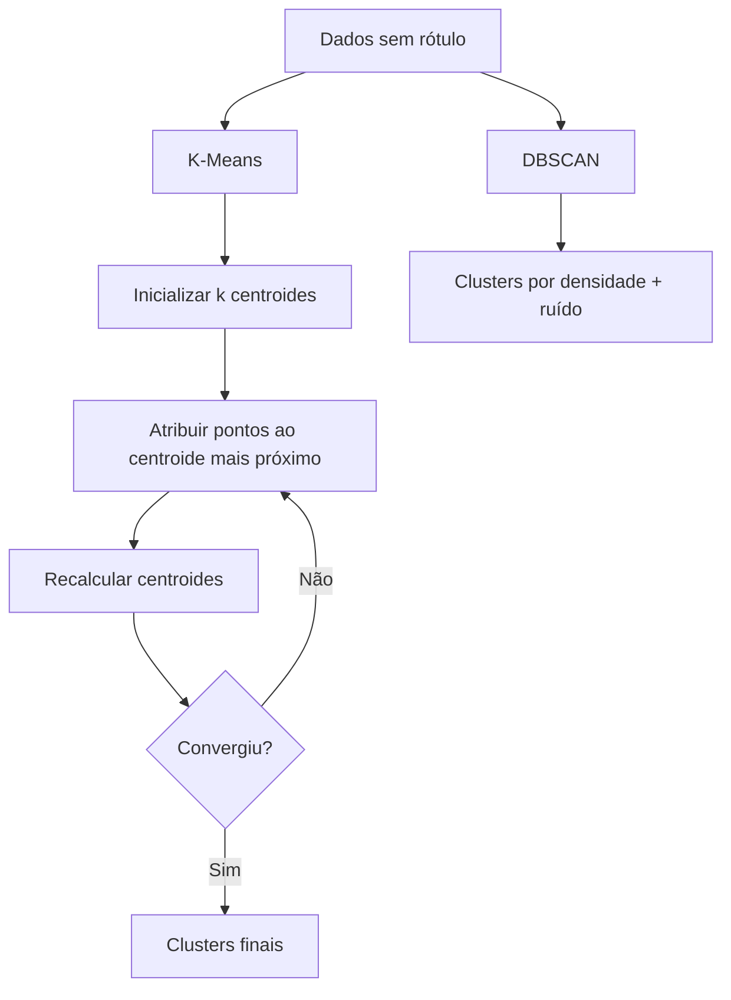

# Aula 3 - Kmeans

**Fase 1 - IA para Devs** | **Seção 4 - Machine Learning Avançado**

---

## Resumo executivo

Esta aula trata de **modelos não supervisionados**, em especial o **K-Means**: algoritmo de clustering que particiona os dados em **k** grupos (clusters) minimizando a soma das distâncias dos pontos ao **centroide** do cluster. Diferente do supervisionado, não há rótulos; o modelo descobre estrutura nos dados. Abordam-se o **método Elbow** para escolher k, **métricas de avaliação de clusters** (ex.: silhueta) e o **DBSCAN** como alternativa (clusters por densidade). Também são introduzidos **desafios do ML**: overfitting, underfitting e o papel da **validação cruzada**.

**Objetivos de aprendizagem:**

- Diferenciar aprendizado supervisionado (target conhecido) do não supervisionado (sem rótulos; clustering).
- Entender K-Means: centroides, iterações (atribuir ponto ao centro mais próximo; recalcular centroides) e convergência.
- Usar o método Elbow (inércia ou distorção vs k) para auxiliar na escolha do número de clusters.
- Conhecer métricas de validação de cluster e o algoritmo DBSCAN (baseado em densidade).
- Relacionar overfitting/underfitting e validação cruzada com a prática de ML.

---

## Conceitos-chave (flashcards)

**P:** O que é aprendizado não supervisionado?  
**R:** Tipo de ML em que **não há target (rótulo)**; o algoritmo busca **estrutura** nos dados (ex.: agrupar em clusters), útil para segmentação e exploração.

**P:** Como o K-Means funciona em poucas palavras?  
**R:** (1) Inicializa k centroides (ex.: aleatório). (2) Atribui cada ponto ao centroide mais próximo. (3) Recalcula cada centroide como a média dos pontos do cluster. (4) Repete (2)–(3) até convergir (centroides estáveis).

**P:** O que é o método Elbow no K-Means?  
**R:** Técnica para escolher k: plota a **inércia** (soma das distâncias ao quadrado dos pontos ao seu centroide) em função de k; o “cotovelo” da curva sugere um k a partir do qual ganho de reduzir inércia diminui.

**P:** O que é DBSCAN?  
**R:** Algoritmo de clustering baseado em **densidade**: forma clusters por regiões densas; pontos em regiões esparsas podem ficar como ruído; não exige definir k antecipadamente.

**P:** O que são overfitting e underfitting?  
**R:** **Overfitting:** modelo se ajusta demais aos dados de treino (incluindo ruído), perdendo generalização. **Underfitting:** modelo muito simples, não captura o padrão dos dados. Validação (ex.: cruzada) e conjuntos treino/teste ajudam a detectar.

---

## Exemplos práticos

```python
# K-Means no Sklearn
from sklearn.cluster import KMeans

kmeans = KMeans(n_clusters=3, random_state=42)
kmeans.fit(X)  # X sem rótulos
labels = kmeans.predict(X)
centroides = kmeans.cluster_centers_
inercia = kmeans.inertia_
```

```python
# Elbow: encontrar k razoável
inercias = []
for k in range(1, 11):
    km = KMeans(n_clusters=k, random_state=42)
    km.fit(X)
    inercias.append(km.inertia_)
# Plotar inercias vs k e identificar o “cotovelo”
```

```python
# DBSCAN (Sklearn)
from sklearn.cluster import DBSCAN

db = DBSCAN(eps=0.5, min_samples=5)
labels_db = db.fit_predict(X)
# labels_db == -1 indica ruído
```

---

## Mapa conceitual

```
Modelos não supervisionados
├── Clustering
│   ├── K-Means (centroides; minimizar inércia)
│   │   ├── Escolha de k: Elbow, métricas (silhueta)
│   │   └── Sensível a inicialização e outliers
│   └── DBSCAN (densidade; ruído = -1)
├── Métricas de validação de cluster
│   └── Silhueta, inércia (dentro do K-Means)
└── Desafios do ML
    ├── Overfitting / underfitting
    └── Validação cruzada (próximas aulas)
```

---

## Receita prática

1. **Definir problema:** não há target → clustering (não supervisionado).
2. **K-Means:** escalonar features se necessário; testar vários k (ex.: 2 a 10); usar Elbow (inércia) ou silhueta para escolher k.
3. **Avaliar clusters:** silhueta, visualização 2D/3D dos clusters.
4. **Alternativa:** se clusters por densidade ou formato irregular, testar DBSCAN (eps, min_samples).
5. **Cuidados:** K-Means sensível a outliers; considerar pré-processamento ou métodos robustos.

---

## Diagrama (Mermaid)



---

## Perguntas para teste de reforço

1. K-Means usa rótulos das amostras? **R:** Não; é não supervisionado; só usa as features para agrupar.
2. O que a inércia mede no K-Means? **R:** Soma das distâncias ao quadrado de cada ponto ao centroide do seu cluster; K-Means minimiza essa soma.
3. Para que serve o método Elbow? **R:** Ajudar a escolher o número k de clusters: no gráfico inércia vs k, o “cotovelo” indica um k a partir do qual aumentar k traz pouco ganho.
4. DBSCAN exige definir k? **R:** Não; forma clusters por densidade (eps, min_samples); pontos em região esparsa podem ser rotulados como ruído (-1).
5. O que é overfitting? **R:** Modelo que se ajusta demais ao treino (incluindo ruído) e performa pior em dados novos.

---

## Materiais de apoio

- Scikit-learn – K-Means: [sklearn.cluster.KMeans](https://scikit-learn.org/stable/modules/clustering.html#k-means)
- Scikit-learn – DBSCAN: [sklearn.cluster.DBSCAN](https://scikit-learn.org/stable/modules/clustering.html#dbscan)
- Métricas de clustering (silhueta): [sklearn.metrics.silhouette_score](https://scikit-learn.org/stable/modules/clustering.html#silhouette-coefficient)
