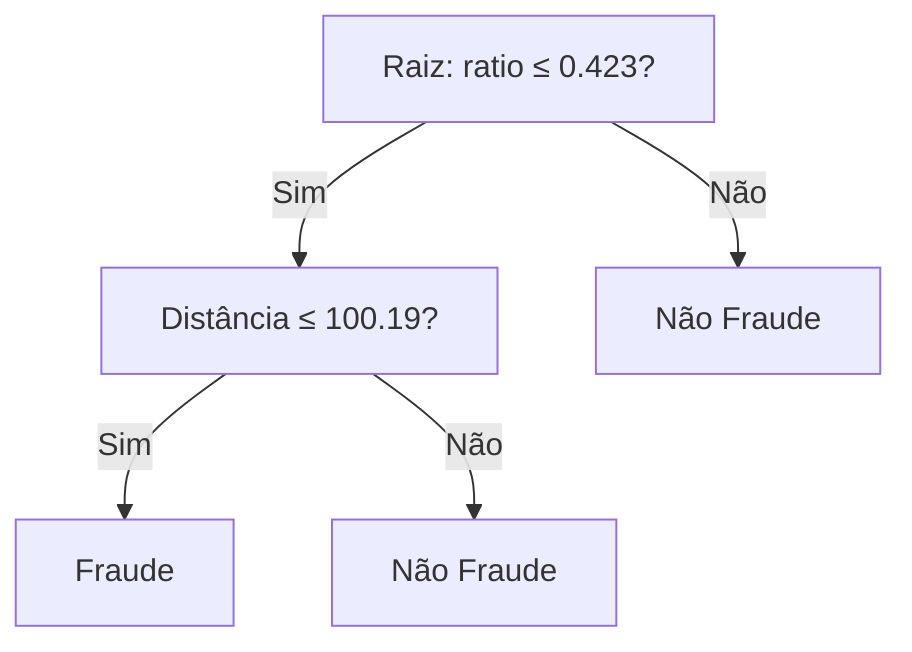

# Aula 4 - Modelos Baseados em Árvores

**Fase 1 - IA para Devs** | **Seção 4 - Machine Learning Avançado**

---

## Resumo executivo

Esta aula cobre **modelos baseados em árvores**: **Árvore de Decisão** (estrutura de regras tipo IF/ELSE em nós e folhas) e **Random Forest** (ensemble de várias árvores; predição por moda/votação). A árvore usa critério de impureza (**gini** ou **entropy**) para decidir os cortes; atributos das folhas incluem **samples**, **value** e **entropy**. Hiperparâmetros de regularização (ex.: **max_depth**, **min_samples_split**, **min_samples_leaf**, **max_leaf_nodes**, **max_features**) ajudam a evitar overfitting. Árvores **não exigem** escalonamento das features. Exemplo da aula: classificação de fraude em transações com `DecisionTreeClassifier` e `RandomForestClassifier` no Sklearn.

**Objetivos de aprendizagem:**

- Entender a estrutura de uma árvore de decisão (raiz, nós, folhas; regras sequenciais).
- Interpretar samples, value e entropy (ou gini) nas folhas; saber que entropy=0 indica pureza da classe.
- Configurar criterion (gini vs entropy) e hiperparâmetros de regularização (max*depth, min_samples*\*).
- Compreender Random Forest: várias árvores, moda das predições; maior robustez e precisão que uma árvore única.
- Aplicar `DecisionTreeClassifier` e `RandomForestClassifier` no Sklearn; plotar árvore com `plot_tree`.

---

## Conceitos-chave (flashcards)

**P:** O que é uma Árvore de Decisão?  
**R:** Modelo que representa **regras de decisão** em forma de árvore (raiz → nós → folhas); cada nó faz uma pergunta sobre uma feature (ex.: ratio ≤ 0,423?); folhas indicam a classe (ou valor na regressão). Analogia: IF/ELSE encadeados.

**P:** O que é entropia (e gini) na árvore?  
**R:** Medida de **impureza** do nó: entropia=0 (ou gini=0) quando todas as amostras no nó são da mesma classe (nó puro). O algoritmo escolhe cortes que reduzem a impureza (ganho de informação).

**P:** Para que serve max_depth?  
**R:** Limita a **profundidade** da árvore (quantos níveis de perguntas); reduzir max_depth **regulariza** e ajuda a evitar overfitting (árvore mais simples).

**P:** O que é Random Forest?  
**R:** **Ensemble** de várias árvores de decisão; cada árvore é treinada com amostra/features aleatórias; a predição final é a **moda** (classificação) ou média (regressão) das predições das árvores; tende a ser mais estável e preciso que uma única árvore.

**P:** Árvores precisam de feature scaling?  
**R:** Não; decisões são baseadas em limiares (ex.: feature_x ≤ 0,42), não em magnitudes absolutas; escalonamento não altera a estrutura da árvore.

---

## Exemplos práticos

```python
# Árvore de decisão - classificação (ex.: fraude)
import pandas as pd
from sklearn.model_selection import train_test_split
from sklearn.tree import DecisionTreeClassifier, plot_tree

dados = pd.read_csv("card_transdata.csv", sep=",")
x = dados.drop(columns=['fraud'])
y = dados['fraud']

x_train, x_test, y_train, y_test = train_test_split(x, y, test_size=0.2, random_state=7)

dt = DecisionTreeClassifier(random_state=7, criterion='entropy', max_depth=2)
dt.fit(x_train, y_train)
y_pred = dt.predict(x_test)

# Plotar árvore
plot_tree(dt, feature_names=x.columns.tolist(),
          class_names=['Fraude', 'Não Fraude'], filled=True)
```

```python
# Random Forest - ensemble de árvores
from sklearn.ensemble import RandomForestClassifier

rf = RandomForestClassifier(n_estimators=5, max_depth=2, random_state=7)
rf.fit(x_train, y_train)
y_pred_rf = rf.predict(x_test)

# Visualizar uma das árvores do ensemble
plot_tree(rf.estimators_[0], feature_names=label_names,
          class_names=class_names, filled=True)
```

---

## Mapa conceitual

```
Modelos baseados em árvores
├── Árvore de Decisão
│   ├── Estrutura: raiz → nós (perguntas) → folhas (classe)
│   ├── Impureza: gini, entropy (criterion)
│   ├── Atributos da folha: samples, value, entropy
│   └── Regularização: max_depth, min_samples_split, min_samples_leaf, max_leaf_nodes, max_features
├── Random Forest
│   ├── Ensemble de árvores; moda das predições
│   └── n_estimators, max_depth (por árvore)
└── Sklearn: DecisionTreeClassifier, RandomForestClassifier, plot_tree
```

---

## Receita prática

1. **Dados:** não é obrigatório escalonar; separar X e y; treino/teste.
2. **Árvore:** escolher criterion (gini ou entropy); limitar max_depth (ex.: 2–10) para regularizar; fit e predict.
3. **Plotar:** `plot_tree(dt, feature_names=..., class_names=..., filled=True)` para interpretar regras.
4. **Random Forest:** definir n_estimators (ex.: 5, 100) e max_depth; fit; predição é a moda das árvores.
5. **Avaliar:** métricas de classificação (acurácia, precisão, recall, F1) no conjunto de teste.

---

## Diagrama (Mermaid)



---

## Perguntas para teste de reforço

1. O que significa entropy=0 em um nó? **R:** Todas as amostras naquele nó pertencem à mesma classe (nó puro).
2. Gini e entropy no Sklearn: qual a diferença prática? **R:** Ambos medem impureza; resultados costumam ser parecidos; gini é um pouco mais rápido de calcular; criterion='entropy' ou 'gini'.
3. Por que reduzir max_depth pode melhorar o desempenho em dados novos? **R:** Árvore mais rasa evita overfitting (menos regras específicas demais para o treino).
4. Como o Random Forest combina as predições das árvores? **R:** Em classificação: **moda** (classe mais votada); em regressão: média.
5. Árvores de decisão precisam de StandardScaler ou MinMaxScaler? **R:** Não; as divisões são por limiares e a ordem dos valores é mantida sem escalonamento.

---

## Materiais de apoio

- Scikit-learn – Decision Tree: [sklearn.tree.DecisionTreeClassifier](https://scikit-learn.org/stable/modules/tree.html)
- Scikit-learn – Random Forest: [sklearn.ensemble.RandomForestClassifier](https://scikit-learn.org/stable/modules/ensemble.html#forest)
- Plot tree: [sklearn.tree.plot_tree](https://scikit-learn.org/stable/modules/generated/sklearn.tree.plot_tree.html)
