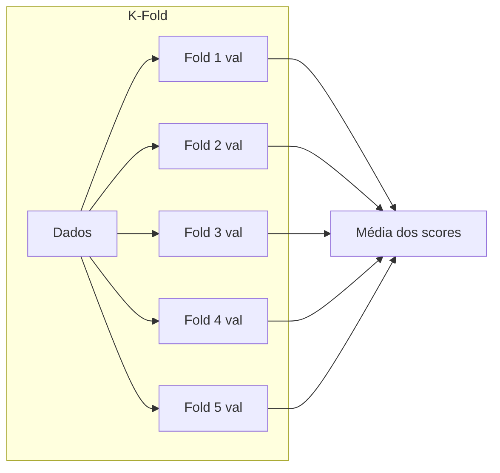

# Aula 5 - Validação Cruzada e Pipeline no Sklearn

**Fase 1 - IA para Devs** | **Seção 4 - Machine Learning Avançado**

---

## Resumo executivo

Esta aula aborda **validação cruzada (k-Fold)** e seu uso para **comparar modelos** e **selecionar hiperparâmetros**. O k-Fold divide o conjunto de treino em **k partes (folds)**; em cada rodada, uma parte é usada como validação e o resto para treino, gerando k scores. A média dos scores dá uma estimativa mais estável do desempenho. No Sklearn: **KFold** (n_splits, shuffle) e **cross_val_score**(modelo, X, y, cv=kfold). A aula mostra como comparar **KNN, SVM e Random Forest** com validação cruzada e como usar **GridSearchCV** para buscar os melhores hiperparâmetros (ex.: n_neighbors, weights, metric do KNN) de forma automática (força bruta sobre param_grid).

**Objetivos de aprendizagem:**

- Entender validação cruzada k-Fold: divisão em folds, treino em k-1 e validação em 1, rotação; score por fold e média.
- Usar KFold(n_splits=5 ou 10, shuffle=True) e cross_val_score para obter scores sem vazamento de dados.
- Comparar vários modelos (KNN, SVM, RF) com cross_val_score e escolher o de melhor score médio.
- Usar GridSearchCV com param*grid, scoring (ex.: accuracy) e cv para seleção de hiperparâmetros; acessar best_params*.

---

## Conceitos-chave (flashcards)

**P:** O que é validação cruzada k-Fold?  
**R:** Técnica que divide os dados de treino em **k subconjuntos (folds)**; em cada uma das k rodadas, um fold é usado como validação e os outros k-1 para treino; ao final há k scores; a **média** (e desvio) dá uma estimativa mais confiável do desempenho do modelo.

**P:** Para que serve shuffle no KFold?  
**R:** **Embaralhar** os dados antes de dividir em folds, evitando que a ordem dos dados (ex.: cronológica) enviesem os folds; melhora a representatividade de cada parte.

**P:** Como a validação cruzada ajuda a escolher o melhor modelo?  
**R:** Aplicando cross_val_score a cada candidato (KNN, SVM, RF, etc.) nos mesmos dados e no mesmo cv; o modelo com **maior score médio** (e critérios como estabilidade entre folds) tende a ser o mais adequado.

**P:** O que é GridSearchCV?  
**R:** Busca em **grade**: testa todas as combinações de hiperparâmetros definidas em **param_grid**; em cada combinação usa **validação cruzada** (cv) para avaliar; retorna o melhor modelo e **best*params*** (e best*score*).

**P:** Qual a vantagem de usar cross_val_score em vez de um único train_test_split?  
**R:** Usar todos os dados para validação (em rodadas diferentes), reduzindo a variância da estimativa de desempenho; evita depender de uma única divisão treino/teste.

---

## Exemplos práticos

```python
# Validação cruzada k-Fold (exemplo da aula)
from sklearn.model_selection import cross_val_score, KFold

kfold = KFold(n_splits=5, shuffle=True)
result = cross_val_score(modelo_classificador, x, y, cv=kfold)
print("Scores por fold:", result)
print("Média (R² ou accuracy):", result.mean())
```

```python
# Comparar vários modelos com validação cruzada
from sklearn.neighbors import KNeighborsClassifier
from sklearn.ensemble import RandomForestClassifier
from sklearn.svm import SVC

kfold = KFold(n_splits=10, shuffle=True)
knn = KNeighborsClassifier(n_neighbors=9, metric='cosine', weights='distance')
svm = SVC()
rf = RandomForestClassifier(random_state=7)

knn_result = cross_val_score(knn, x, y, cv=kfold)
svm_result = cross_val_score(svm, x, y, cv=kfold)
rf_result = cross_val_score(rf, x, y, cv=kfold)

print("KNN:", knn_result.mean(), "SVM:", svm_result.mean(), "RF:", rf_result.mean())
melhor = max([("KNN", knn_result.mean()), ("SVM", svm_result.mean()), ("RF", rf_result.mean())], key=lambda x: x[1])
print("Melhor modelo:", melhor[0])
```

```python
# GridSearchCV - buscar melhores hiperparâmetros (ex.: KNN)
from sklearn.model_selection import GridSearchCV
from sklearn.metrics import make_scorer, accuracy_score

param_grid = {
    'n_neighbors': [9, 14],
    'weights': ['uniform', 'distance'],
    'metric': ['cosine', 'euclidean', 'manhattan']
}
gs_metric = make_scorer(accuracy_score, greater_is_better=True)
grid = GridSearchCV(KNeighborsClassifier(), param_grid=param_grid, scoring=gs_metric, cv=5, n_jobs=4, verbose=3)
grid.fit(x_train_scaled, y_train)
print('Melhores params KNN:', grid.best_params_)
```

---

## Mapa conceitual

```
Validação cruzada e pipeline
├── K-Fold
│   ├── n_splits (ex.: 5, 10); shuffle=True
│   ├── cross_val_score(modelo, X, y, cv=kfold)
│   └── Comparar modelos (média dos scores)
├── GridSearchCV
│   ├── param_grid (grade de hiperparâmetros)
│   ├── scoring (ex.: accuracy); cv (folds)
│   └── best_params_, best_score_
└── Pipeline (pré-processamento + modelo) – encadeamento
```

---

## Receita prática

1. **Configurar KFold:** KFold(n_splits=5 ou 10, shuffle=True).
2. **Comparar modelos:** treinar KNN, SVM, RF (com dados escalonados quando necessário); cross_val_score para cada um; escolher o de maior média.
3. **GridSearch:** definir param*grid com os hiperparâmetros a testar; GridSearchCV(modelo, param_grid, scoring, cv=5); fit em x_train, y_train; usar best_params* no modelo final.
4. **Cuidado:** escalonar apenas com fit no treino e transform no treino e teste (ou usar Pipeline para evitar vazamento).

---

## Diagrama (Mermaid)



---

## Perguntas para teste de reforço

1. O que cross_val_score retorna? **R:** Array com um score por fold (ex.: 5 scores para cv=5); a média é a estimativa de desempenho do modelo.
2. Por que shuffle no KFold? **R:** Evitar que a ordem dos dados (ex.: temporal) deixe um fold com distribuição diferente; torna os folds mais representativos.
3. GridSearchCV usa validação cruzada? **R:** Sim; para cada combinação de param_grid ele roda cv (ex.: 5 folds) e usa a média (ou critério definido) para escolher a melhor combinação.
4. O que é param_grid? **R:** Dicionário em que cada chave é um hiperparâmetro e cada valor é uma lista de opções; GridSearchCV testa todas as combinações.
5. Depois do GridSearchCV.fit(), como usar o melhor modelo? **R:** grid.best*estimator* já é o modelo treinado com best*params*; ou instanciar o modelo com grid.best*params* e treinar de novo se preferir.

---

## Materiais de apoio

- Scikit-learn – cross_val_score: [sklearn.model_selection.cross_val_score](https://scikit-learn.org/stable/modules/cross_validation.html)
- Scikit-learn – KFold: [sklearn.model_selection.KFold](https://scikit-learn.org/stable/modules/generated/sklearn.model_selection.KFold.html)
- Scikit-learn – GridSearchCV: [sklearn.model_selection.GridSearchCV](https://scikit-learn.org/stable/modules/generated/sklearn.model_selection.GridSearchCV.html)
