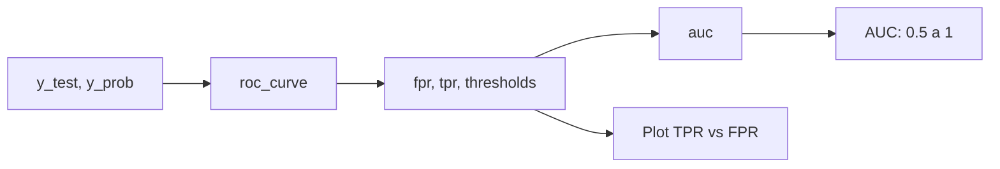

# Aula 7 - AUC score e ROC Curve

**Fase 1 - IA para Devs** | **Seção 4 - Machine Learning Avançado**

---

## Resumo executivo

Esta aula apresenta duas métricas para **classificadores binários** que retornam **probabilidade ou score**: **curva ROC (Receiver Operating Characteristic)** e **AUC (Area Under the ROC Curve)**. A **curva ROC** plota **Taxa de Verdadeiros Positivos (TPR = sensibilidade = Recall)** no eixo Y versus **Taxa de Falsos Positivos (FPR)** no eixo X, variando o limiar (threshold) de decisão. Quanto mais a curva se afasta da diagonal (threshold 0,5) e se aproxima do canto superior esquerdo, melhor o modelo **ranqueia** positivos acima de negativos. A **AUC** é a área sob a curva ROC: 1 = classificador perfeito; 0,5 = aleatório; valor entre 0,5 e 1 indica capacidade de discriminação. No Sklearn: **roc_curve**, **auc** e **predict_proba** para obter as probabilidades necessárias.

**Objetivos de aprendizagem:**

- Entender a curva ROC: eixos TPR vs FPR; interpretar curva próxima de 1 (bom) vs próxima da diagonal (ruim).
- Calcular AUC; interpretar AUC=1 (perfeito), AUC=0,5 (aleatório), AUC entre 0,5 e 1 (discriminação).
- Usar roc_curve(y_true, y_prob) e auc(fpr, tpr); plotar ROC com matplotlib.
- Saber que ROC/AUC exigem classificador que retorne probabilidade ou score (ex.: predict_proba).

---

## Conceitos-chave (flashcards)

**P:** O que é a curva ROC?  
**R:** Gráfico que mostra **TPR (True Positive Rate = Recall)** no eixo Y e **FPR (False Positive Rate)** no eixo X, para vários **thresholds** de decisão; permite avaliar a capacidade do modelo de ranquear positivos acima de negativos sem fixar um threshold.

**P:** O que significa a curva ROC estar “longe” da diagonal (0,5)?  
**R:** O modelo tem **poder discriminativo**: consegue ranquear exemplos positivos com scores maiores que os negativos; curva próxima da diagonal indica modelo próximo do aleatório (AUC ≈ 0,5).

**P:** O que é a AUC?  
**R:** **Área sob a curva ROC**; resume em um número (0 a 1) a qualidade da curva: AUC=1 (perfeito), AUC=0,5 (aleatório), AUC entre 0,5 e 1 indica quão bem o modelo separa as classes (independente do threshold escolhido).

**P:** Por que ROC/AUC são para classificadores que retornam probabilidade/score?  
**R:** A curva varia o **threshold** (ex.: classificar como 1 se prob > 0,3, 0,5, 0,7…); sem probabilidade/score contínuo não há como traçar a curva. Por isso usa-se predict_proba (ou decision_function em SVM).

**P:** Quando AUC ≈ 0,5? **R:** Quando o modelo não consegue ranquear positivos acima de negativos (discriminação nula); equivalente a chute aleatório.

---

## Exemplos práticos

```python
# Curva ROC e AUC (exemplo da aula)
from sklearn.metrics import roc_curve, auc
import matplotlib.pyplot as plt

# Obter probabilidades da classe positiva (coluna 1)
y_prob = modelo_classificador.predict_proba(x_test_escalonado)[:, 1]

fpr, tpr, thresholds = roc_curve(y_test, y_prob)
roc_auc = auc(fpr, tpr)

plt.figure(figsize=(10, 10))
plt.title('Receiver Operating Characteristic')
plt.plot(fpr, tpr, color='red', label='AUC = %0.2f' % roc_auc)
plt.legend(loc='lower right')
plt.plot([0, 1], [0, 1], linestyle='--')  # linha aleatória
plt.xlabel('False Positive Rate')
plt.ylabel('True Positive Rate')
plt.axis('tight')
plt.show()
```

```python
# AUC como número
print('AUC:', roc_auc)  # 1.0 = perfeito; 0.5 = aleatório
```

---

## Mapa conceitual

```
ROC e AUC
├── Curva ROC
│   ├── Eixo X: FPR (False Positive Rate)
│   ├── Eixo Y: TPR (True Positive Rate = Recall)
│   ├── Variação do threshold de decisão
│   └── Bom: curva perto do canto (0,0)-(0,1)-(1,1); ruim: perto da diagonal
├── AUC (Area Under the Curve)
│   ├── 1 = perfeito; 0,5 = aleatório
│   └── Resumo da capacidade de discriminação
└── Sklearn: roc_curve, auc; modelo precisa de predict_proba (ou decision_function)
```

---

## Receita prática

1. **Garantir probabilidades:** usar modelo com predict_proba (ex.: LogisticRegression, RandomForest, KNN com weights='distance'); para SVM, decision_function.
2. **Calcular ROC:** fpr, tpr, thresholds = roc_curve(y_test, y_prob[:, 1]); roc_auc = auc(fpr, tpr).
3. **Plotar:** plot(fpr, tpr); linha [0,0]-[1,1] para referência (aleatório).
4. **Interpretar:** AUC > 0,8 em geral bom; AUC ≈ 0,5 indica que o modelo não discrimina; curva “levantada” para cima à esquerda = bom ranqueamento.

---

## Diagrama (Mermaid)



---

## Perguntas para teste de reforço

1. O que são TPR e FPR na curva ROC? **R:** TPR = True Positive Rate = Recall (sensibilidade). FPR = proporção de negativos classificados como positivos (1 - especificidade).
2. Por que traçar a linha [0,0]-[1,1] no gráfico ROC? **R:** Representa um classificador **aleatório** (AUC=0,5); a curva do modelo deve ficar **acima** dessa linha para indicar discriminação.
3. Um classificador com AUC=0,9 é sempre melhor que um com AUC=0,7? **R:** Em geral sim para capacidade de ranqueamento; mas a decisão final de uso pode depender do threshold escolhido e dos custos de FP/FN (curva ROC não fixa threshold).
4. SVM não tem predict_proba por padrão em algumas configs; o que usar? **R:** decision_function (distância ao hiperplano) pode ser usada em roc_curve no lugar de probabilidade; ou SVC(probability=True) para habilitar predict_proba.
5. O que significa “modelo ranqueia positivos acima de negativos”? **R:** Em média, os exemplos positivos recebem score/probabilidade maior que os negativos; a curva ROC reflete isso (área sob a curva > 0,5).

---

## Materiais de apoio

- Scikit-learn – roc_curve: [sklearn.metrics.roc_curve](https://scikit-learn.org/stable/modules/generated/sklearn.metrics.roc_curve.html)
- Scikit-learn – auc: [sklearn.metrics.auc](https://scikit-learn.org/stable/modules/generated/sklearn.metrics.auc.html)
- ROC and AUC: [sklearn User Guide – ROC](https://scikit-learn.org/stable/auto_examples/model_selection/plot_roc.html)
