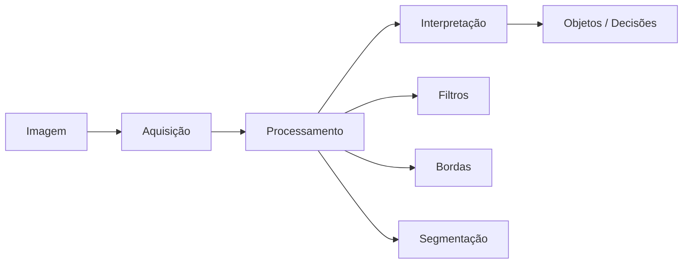

# Aula 1 - Introdução a Visão Computacional

**Fase 1 - IA para Devs** | **Seção 5 - Computer Vision**

---

## Resumo executivo

Esta aula introduz **visão computacional**: campo da IA que permite aos computadores **interpretar e compreender o mundo visual** (imagens e vídeos), envolvendo **aquisição**, **processamento** e **análise** para extrair informações. Aplicações incluem segurança (vigilância, reconhecimento facial), automação (robôs, veículos autônomos), medicina (diagnóstico por imagem), entretenimento (realidade aumentada, jogos). São apresentados **componentes** de um sistema (aquisição → processamento → interpretação), **fundamentos** (pixels, resolução, canais RGB/grayscale, representação em matrizes) e um **hands-on** com **OpenCV**: carregar/exibir imagens, converter para grayscale, redimensionar, aplicar filtros de suavização, detecção de bordas (Canny) e desenhar formas. Marco histórico: de Larry Roberts (1963) e David Marr (Vision, 1981) a AlexNet (2012), GANs (2014), YOLO (2015) e Vision Transformer (2020).

**Objetivos de aprendizagem:**

- Definir visão computacional e citar aplicações (segurança, medicina, automação, entretenimento).
- Descrever os três componentes: aquisição de imagem, processamento, interpretação.
- Entender imagem digital: pixels, resolução, RGB vs grayscale, representação em matrizes.
- Realizar operações básicas com OpenCV: carregar, exibir, grayscale, redimensionar, filtros, Canny, desenho.

---

## Conceitos-chave (flashcards)

**P:** O que é visão computacional?  
**R:** Área da IA que capacita computadores a **interpretar e compreender** imagens e vídeos (aquisição, processamento e análise) para extrair informações significativas, de forma análoga à visão humana.

**P:** Quais os três componentes de um sistema de visão computacional?  
**R:** (1) **Aquisição**: captura por câmeras, scanners, sensores. (2) **Processamento**: filtragem, transformação, segmentação. (3) **Interpretação**: identificar/classificar objetos, reconhecer padrões, tomar decisões.

**P:** Como uma imagem colorida é representada em termos de canais?  
**R:** Três **canais** (matrizes): **RGB** (Red, Green, Blue); cada pixel tem três valores (0–255). Em **grayscale** há um único canal (intensidade 0–255).

**P:** O que é o detector de bordas de Canny?  
**R:** Algoritmo clássico de **detecção de bordas** em imagens (gradiente, supressão de não-máximos, limiarização); usado como etapa em pipelines de detecção de objetos e segmentação.

**P:** Qual o papel das CNNs na visão computacional?  
**R:** Redes neurais convolucionais (ex.: AlexNet 2012) revolucionaram reconhecimento de imagem, detecção de objetos e segmentação; aprendem features hierárquicas a partir dos pixels.

---

## Exemplos práticos

```python
# OpenCV - carregar e exibir imagem
import cv2
img = cv2.imread("caminho/para/imagem.jpg")
cv2.imshow("Janela", img)
cv2.waitKey(0)
cv2.destroyAllWindows()
```

```python
# Converter para grayscale
img_cinza = cv2.cvtColor(img, cv2.COLOR_BGR2GRAY)
```

```python
# Redimensionar
img_redim = cv2.resize(img, (largura, altura))
```

```python
# Suavização (filtro Gaussiano) e detecção de bordas (Canny)
suave = cv2.GaussianBlur(img_cinza, (5, 5), 0)
bordas = cv2.Canny(suave, 50, 150)
```

---

## Mapa conceitual

```
Visão computacional
├── Definição e aplicações (segurança, medicina, automação, entretenimento)
├── Componentes: aquisição → processamento → interpretação
├── Fundamentos: pixels, resolução, RGB, grayscale, matrizes
├── Hands-on OpenCV: carregar, grayscale, redimensionar, filtros, Canny, desenho
├── História: Roberts, Marr, Canny, Viola-Jones, AlexNet, GANs, YOLO, ViT
└── Tópicos avançados: reconhecimento de padrões, segmentação, CNNs, realidade aumentada
```

---

## Receita prática

1. **Ambiente:** instalar OpenCV (`pip install opencv-python`).
2. **Carregar/exibir:** `cv2.imread`, `cv2.imshow`; em notebooks/Colab usar `cv2_imshow` ou matplotlib.
3. **Pré-processamento:** grayscale (`cvtColor`), resize, suavização (`GaussianBlur`) para reduzir ruído.
4. **Bordas:** `cv2.Canny(imagem, limiar_baixo, limiar_alto)` após suavização.
5. **Salvar:** `cv2.imwrite("saida.png", imagem)`.

---

## Diagrama (Mermaid)



---

## Perguntas para teste de reforço

1. O que é um pixel? **R:** Menor unidade de uma imagem digital; em RGB são três valores (R,G,B); em grayscale um valor de intensidade.
2. Para que serve a suavização antes do Canny? **R:** Reduzir ruído para que o detector de bordas não destaque ruído como borda; melhora a qualidade das bordas detectadas.
3. Cite dois marcos na história da visão computacional. **R:** Ex.: Detector de Canny (1973), AlexNet/ILSVRC (2012), YOLO (2015), GANs (2014), Vision Transformer (2020).
4. Qual a diferença entre BGR (OpenCV) e RGB? **R:** OpenCV usa ordem de canais BGR por convenção histórica; ao exibir com matplotlib pode ser necessário converter para RGB (cv2.COLOR_BGR2RGB).
5. O que a “interpretação” de imagem inclui? **R:** Identificar e classificar objetos, reconhecer padrões e tomar decisões com base na análise visual (ex.: detecção de rostos, leitura de placas).

---

## Materiais de apoio

- OpenCV: [opencv.org](https://opencv.org/) e documentação Python.
