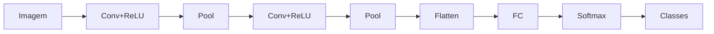

# Aula 4 - Redes Neurais Convolucionais (CNN)

**Fase 1 - IA para Devs** | **Seção 5 - Computer Vision**

---

## Resumo executivo

Esta aula trata de **Redes Neurais Convolucionais (CNNs)**: arquiteturas de deep learning desenhadas para dados com estrutura espacial (imagens). A **convolução** aplica filtros (kernels) que extraem **features** locais (bordas, texturas, padrões); camadas consecutivas aprendem representações cada vez mais abstratas. Componentes típicos: **Conv2D** (convolução), **Pooling** (redução de dimensão, ex.: max pooling), **ReLU** (não linearidade), e no final **camadas densas (FC)** para classificação. CNNs reduzem parâmetros em relação a redes totalmente conectadas ao reutilizar filtros (pesos compartilhados) e ao explorar localidade. Aplicações: classificação de imagem, detecção de objetos, segmentação. Marco histórico: AlexNet (2012), VGG, ResNet, etc. Este resumo consolida os conceitos centrais.

**Objetivos de aprendizagem:**

- Entender a operação de **convolução** em imagens (filtro deslizante; extração de features locais).
- Identificar os blocos de uma CNN: convolução, ativação (ReLU), pooling, camadas fully connected.
- Compreender por que CNNs são adequadas a imagens (localidade, invariância espacial parcial, compartilhamento de pesos).
- Conhecer arquiteturas clássicas (ex.: AlexNet, VGG) e o papel de camadas mais profundas (features mais abstratas).

---

## Conceitos-chave (flashcards)

**P:** O que é uma convolução em uma CNN?  
**R:** Operação que aplica um **filtro (kernel)** deslizante sobre a imagem (ou mapa de features); cada posição produz um valor (soma ponderada); extrai **padrões locais** (bordas, texturas).

**P:** Para que serve o pooling (ex.: max pooling)?  
**R:** **Reduzir** dimensão espacial (altura/largura), diminuindo parâmetros e custo computacional; **max pooling** mantém o valor máximo em cada janela, ajudando a manter a informação mais forte e dar invariância a pequenos deslocamentos.

**P:** Por que CNN em vez de rede totalmente conectada para imagem?  
**R:** (1) **Localidade**: pixels próximos se relacionam. (2) **Compartilhamento de pesos**: o mesmo filtro é usado em toda a imagem, menos parâmetros. (3) **Hierarquia**: primeiras camadas = bordas/texturas; camadas profundas = partes de objetos e objetos.

**P:** O que a camada fully connected (FC) faz no final da CNN?  
**R:** Recebe o mapa de features “achatado” e produz o **vetor de saída** (ex.: probabilidades por classe); faz a decisão de classificação a partir das features extraídas pelas convoluções.

**P:** O que é ReLU e por que é usada?  
**R:** **Rectified Linear Unit**: f(x)=max(0,x); introduz **não linearidade** (a pilha de convoluções sozinha seria equivalente a uma única convolução); acelera treino e evita alguns problemas de gradiente em relação a sigmoid/tanh.

---

## Mapa conceitual

```
CNN
├── Convolução: filtros, extração de features locais
├── Ativação: ReLU (não linearidade)
├── Pooling: max/avg, redução espacial
├── Blocos repetidos: Conv → ReLU → Pool
├── Camadas FC: classificação final
└── Arquiteturas: AlexNet, VGG, ResNet, etc.
```

---

## Receita prática

1. **Entrada:** imagens com dimensões fixas (ex.: 224x224); normalizar pixels (ex.: 0–1 ou padronizado).
2. **Bloco típico:** Conv2D (múltiplos filtros) → ReLU → MaxPooling2D; repetir para aumentar profundidade de features.
3. **Final:** Flatten → Dense (hidden) → ReLU → Dense (num_classes) → Softmax (para classificação).
4. **Treino:** loss (ex.: cross-entropy), otimizador (Adam), métricas (accuracy); data augmentation para generalização.
5. **Transfer learning:** usar CNN pré-treinada (ex.: ImageNet) e fine-tune nas suas classes.

---

## Diagrama (Mermaid)



---

## Perguntas para teste de reforço

1. O que o kernel (filtro) em uma convolução representa? **R:** Um padrão local (ex.: borda vertical, textura); a rede aprende os valores do kernel durante o treino.
2. Max pooling 2x2 com stride 2 reduz a dimensão em quanto? **R:** Metade em altura e largura (divisão por 2 em cada eixo); área total fica 1/4.
3. Por que “convolucional”? **R:** A operação matemática é uma **convolução** (soma do elemento a elemento do kernel com a região da imagem, em cada posição).
4. O que são “features hierárquicas”? **R:** Primeiras camadas capturam bordas e texturas; camadas mais profundas combinam essas informações em partes de objetos e depois objetos inteiros.
5. O que é transfer learning em CNN? **R:** Usar uma rede **pré-treinada** (ex.: em ImageNet) e reutilizar suas camadas (em geral iniciais) para uma nova tarefa; treinar só as últimas camadas ou fazer fine-tuning; economiza dados e tempo.

---

## Materiais de apoio

- Deep Learning (Goodfellow et al.) – capítulo sobre CNNs.
- FIAP – Conteúdo didático: aula 4, Seção 5; notebooks e referências na plataforma.
