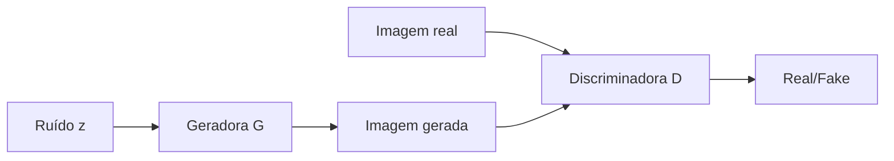

# Aula 6 - Redes Neurais Adversativas (GAN)

**Fase 1 - IA para Devs** | **Seção 5 - Computer Vision**

---

## Resumo executivo

Esta aula trata de **GANs (Generative Adversarial Networks)**: arquiteturas que envolvem duas redes em **competição**. A **geradora (G)** gera amostras (ex.: imagens) a partir de um vetor de ruído (latent space); a **discriminadora (D)** tenta distinguir amostras **reais** das **geradas**. Objetivo: G enganar D, e D ser um bom classificador; no equilíbrio, G produz amostras realistas. Treino **adversarial**: atualiza-se G para maximizar o erro de D (fazer D classificar geradas como reais) e D para minimizar seu erro (reais=1, geradas=0). Aplicações em visão: geração de imagens, super-resolução, data augmentation, transferência de estilo. Desafios: instabilidade de treino, mode collapse (G produz pouca variedade). Ian Goodfellow et al. (2014). Este resumo consolida os conceitos centrais.

**Objetivos de aprendizagem:**

- Entender a estrutura de uma GAN: geradora (G) e discriminadora (D) em jogo minimax.
- Compreender o objetivo da geradora (produzir amostras que “enganem” a discriminadora) e da discriminadora (classificar real vs fake).
- Conhecer o treino adversarial: atualização alternada ou conjunta de G e D; loss de G e de D.
- Citar aplicações (geração de imagens, super-resolução, augmentation) e problemas (instabilidade, mode collapse).

---

## Conceitos-chave (flashcards)

**P:** O que é uma GAN?  
**R:** Arquitetura com duas redes: **Geradora (G)** gera amostras a partir de ruído; **Discriminadora (D)** classifica se a amostra é real ou gerada; treinadas de forma **adversarial** (G tenta enganar D, D tenta acertar).

**P:** O que a geradora recebe como entrada?  
**R:** Um **vetor de ruído** (latent vector) amostrado de uma distribuição (ex.: normal); a partir dele gera uma amostra (ex.: imagem) com a mesma dimensão das amostras reais.

**P:** O que a discriminadora faz? **R:** Recebe uma amostra (real ou gerada) e **classifica** em “real” (1) ou “fake” (0); é um classificador binário; durante o treino torna-se mais capaz de distinguir, forçando G a melhorar.

**P:** O que é mode collapse?  
**R:** Fenômeno em que a **geradora** produz pouca **variedade** (ex.: sempre a mesma face ou padrão); “colapsa” para poucos modos da distribuição; é um desafio de treino de GANs.

**P:** Para que GANs são usadas em visão computacional?  
**R:** **Geração** de imagens realistas, **super-resolução** (SRGAN), **data augmentation**, **transferência de estilo**, **inpainting**; também em geração condicional (ex.: texto → imagem).

---

## Mapa conceitual

```
GAN
├── Geradora G: ruído → amostra (imagem)
├── Discriminadora D: amostra → real (1) ou fake (0)
├── Treino adversarial: min-max (G maximiza erro de D, D minimiza seu erro)
├── Aplicações: geração, super-resolução, augmentation, estilo
└── Desafios: instabilidade, mode collapse
```

---

## Diagrama (Mermaid)



---

## Receita prática

1. **Definir G:** entrada = vetor z (dims fixas); camadas (Dense, Conv2DTranspose); saída = imagem (ex.: 64x64x3).
2. **Definir D:** entrada = imagem; convoluções ou MLP; saída = um valor (probabilidade de ser real).
3. **Treino:** (a) Treinar D: labels 1 para reais, 0 para geradas; loss binária. (b) Treinar G: passar amostras geradas para D com labels 1 (enganar D); atualizar só G. Repetir.
4. **Inferência:** usar apenas G; amostrar z e gerar imagem.
5. **Cuidados:** balancear treino de G e D; usar boas práticas (ex.: batch norm, learning rate, arquiteturas estáveis como DCGAN).

---

## Perguntas para teste de reforço

1. Por que o treino é “adversarial”? **R:** G e D têm objetivos opostos: D quer acertar real vs fake; G quer que D erre (classifique geradas como reais); uma rede “ataca” a outra, levando a melhoria de ambas.
2. O que é o latent space (espaço latente)? **R:** O **espaço do vetor de ruído z** que alimenta a geradora; cada ponto em z corresponde a uma amostra gerada; a G aprende a mapear z em imagens plausíveis.
3. Por que às vezes congelamos D ao treinar G? **R:** Ao atualizar G, queremos que o gradiente flua através de D até G; D é mantida em modo avaliação (não atualizamos seus pesos) nesse passo, para que a atualização de G seja baseada no “feedback” atual de D.
4. DCGAN: o que o “DC” significa? **R:** **Deep Convolutional** GAN: usa convoluções na G (Conv2DTranspose) e na D (Conv2D); arquitetura que ajudou a estabilizar o treino de GANs para imagens.
5. GAN pode ser condicional? **R:** Sim (**cGAN**): G e/ou D recebem uma **condição** (ex.: classe, texto); G gera amostras condicionadas a essa informação (ex.: “gato” → imagem de gato).

---

## Materiais de apoio

- Goodfellow et al. (2014) – “Generative Adversarial Networks”, artigo original.
