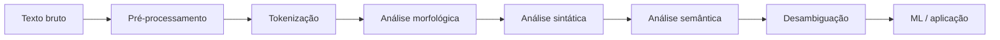

# Aula 1 - Definição, aplicações

## Resumo executivo

Esta aula introduz **Processamento de Linguagem Natural (PLN/NLP)**: definição, objetivos, funcionamento em etapas (pré-processamento, tokenização, análises morfológica/sintática/semântica, desambiguação) e **aplicações práticas** (chatbots, assistentes virtuais, análise de sentimentos, previsão em buscas, tradução). Aborda a **origem** (Turing, ELIZA, evolução com ML e Deep Learning) e os **desafios** atuais (semântica, ironia, multilingue).

**Objetivos de aprendizagem:**
- Definir PLN e diferenciá-lo de linguagens formais.
- Listar objetivos e níveis de análise (fonético a pragmático).
- Descrever o pipeline típico (pré-processamento → tokenização → análise → ML).
- Reconhecer aplicações no cotidiano e em empresas.

---

## Conceitos-chave (flashcards)

1. **O que é PLN?** **R:** Disciplina da Ciência da Computação que desenvolve programas para analisar, reconhecer e/ou gerar texto em linguagem natural; converge computação, IA e linguística.
2. **Quais os três níveis de reconhecimento na técnica de PLN?** **R:** Morfológico (forma e características gramaticais), sintático (relacionamentos entre palavras e frases), semântico (significado e contexto).
3. **O que é tokenização?** **R:** Divisão do texto em unidades menores (tokens) para facilitar análise e compreensão.
4. **O que são stop words?** **R:** Palavras consideradas desnecessárias para a análise (ex.: artigos, preposições), removidas no pré-processamento.
5. **Para que serve a desambiguação?** **R:** Resolver ambiguidades da linguagem natural e escolher o significado mais apropriado com base no contexto.
6. **Cite três aplicações do PLN.** **R:** Chatbots, análise de sentimentos, sugestões de busca (autocomplete), assistentes virtuais, tradução automática, correção gramatical.
7. **Qual a origem histórica do PLN?** **R:** Ideia associada ao teste de Turing (1950); primeiros sistemas como ELIZA (anos 60); depois regras, depois ML e Deep Learning.

---

## Exemplos práticos

### Exemplo 1: Tokenização simples em Python (NLTK)

```python
import nltk
nltk.download("punkt_tab", quiet=True)

texto = "O Processamento de Linguagem Natural está em todo lugar."
tokens = nltk.word_tokenize(texto)
print(tokens)
# ['O', 'Processamento', 'de', 'Linguagem', 'Natural', 'está', 'em', 'todo', 'lugar', '.']
```

### Exemplo 2: Remoção de stop words (conceitual)

```python
# Lista mínima de stop words em português
stop_words = {"o", "a", "de", "em", "e", "está", "todo"}

tokens = ["O", "Processamento", "de", "Linguagem", "Natural", "está", "em", "todo", "lugar"]
tokens_limpos = [t for t in tokens if t.lower() not in stop_words]
print(tokens_limpos)
# ['Processamento', 'Linguagem', 'Natural', 'lugar']
```

### Exemplo 3: Uso de pipeline de PLN (sklearn + texto)

```python
# Ideia: contar palavras para classificação (Bag of Words simplificado)
from sklearn.feature_extraction.text import CountVectorizer

textos = [
    "PLN analisa texto e linguagem natural.",
    "Linguagem natural e texto são o foco do PLN.",
]
vec = CountVectorizer()
X = vec.fit_transform(textos)
print(vec.get_feature_names_out())
print(X.toarray())
```

---

## Mapa conceitual

```
PLN (Processamento de Linguagem Natural)
├── Definição e objetivos
│   ├── Análise, reconhecimento e geração de texto
│   ├── Níveis: fonético, morfológico, sintático, semântico, pragmático
│   └── Recuperação de informação, tradução, interpretação
├── Funcionamento (pipeline)
│   ├── Pré-processamento (pontuação, case, stop words)
│   ├── Tokenização
│   ├── Análises (morfológica, sintática, semântica)
│   ├── Desambiguação
│   └── Machine Learning (classificação, sentimentos, etc.)
└── Aplicações
    ├── Chatbots e assistentes virtuais
    ├── Análise de sentimentos
    ├── Busca e previsão (autocomplete)
    ├── Tradução e correção gramatical
    └── Modelos de linguagem (ex.: ChatGPT)
```

---

## Receita prática

**Como aplicar os conceitos de PLN em um projeto:**

1. **Definir o objetivo:** classificação de texto, análise de sentimentos, extração de entidades, etc.
2. **Pré-processar:** normalizar (minúsculas, acentos se desejado), remover pontuação e stop words, tokenizar.
3. **Escolher representação:** Bag of Words, TF-IDF ou embeddings (ex.: Word2Vec, mais à frente no curso).
4. **Treinar modelo:** usar classificador (ex.: sklearn, NLTK) ou redes neurais conforme a tarefa.
5. **Avaliar e iterar:** métricas de acurácia/F1, ajuste de pré-processamento e hiperparâmetros.

---

## Diagrama



---

## Perguntas para teste de reforço

1. O que é PLN e qual a diferença em relação a linguagens de programação?  
   **R:** PLN lida com linguagem natural (humana), ambígua e variável; linguagens de programação são formais e não ambíguas.

2. Cite duas etapas do pipeline computacional do PLN.  
   **R:** Pré-processamento (ex.: remoção de stop words) e tokenização.

3. O que são os níveis morfológico, sintático e semântico?  
   **R:** Morfológico: forma das palavras; sintático: estrutura da frase; semântico: significado e contexto.

4. Para que serve a desambiguação?  
   **R:** Resolver ambiguidades e escolher o significado mais adequado ao contexto.

5. Dê um exemplo de aplicação do PLN no dia a dia.  
   **R:** Sugestões de busca no Google, análise de comentários em redes sociais, chatbots de atendimento.

6. Qual papel do Machine Learning no PLN?  
   **R:** Ajustar modelos aos dados para tarefas preditivas (classificação, sentimentos, tradução, etc.).

---

## Materiais de apoio

- AWS – O que é processamento de linguagem natural (PLN)? [aws.amazon.com/pt/what-is/nlp](https://aws.amazon.com/pt/what-is/nlp)
- NLTK – Natural Language Toolkit: [nltk.org](https://www.nltk.org/)
- Scikit-learn – Text feature extraction: [CountVectorizer](https://scikit-learn.org/stable/modules/feature_extraction.html#text-feature-extraction)
