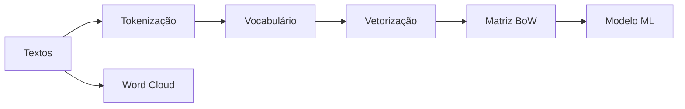

# Aula 2 - Bag of words, Word cloud

## Resumo executivo

Esta aula aborda **Bag of Words (BoW)** e **Word Cloud** em PLN. O **BoW** representa documentos como conjuntos não ordenados de palavras (vetores de contagem ou presença), ignorando ordem e estrutura gramatical; etapas típicas: tokenização, construção do vocabulário, vetorização (ex.: **CountVectorizer** no sklearn). É aplicado em classificação de texto e análise de sentimentos (ex.: regressão logística sobre vetores BoW). **Word Cloud** é uma visualização em que o tamanho da palavra é proporcional à sua frequência no corpus; útil para insights rápidos e análise exploratória. A aula inclui hands-on: dataset de avaliações (B2W), limpeza de colunas, split treino/teste, vetorização com `max_features`, treino de regressão logística e geração de nuvens de palavras para sentimentos positivos e negativos.

**Objetivos de aprendizagem:**
- Explicar o que é Bag of Words e por que modelos de ML precisam de representação numérica do texto.
- Descrever tokenização, vocabulário e vetorização (contagem ou binária).
- Implementar BoW com CountVectorizer e classificar sentimentos com regressão logística.
- Criar Word Cloud (wordcloud + matplotlib) e interpretar palavras mais frequentes por polaridade.

---

## Conceitos-chave (flashcards)

1. **O que é Bag of Words?** **R:** Técnica que representa cada documento como um vetor indicando contagem (ou presença) de palavras do vocabulário, ignorando ordem e estrutura gramatical.
2. **Por que o modelo de ML “não entende” texto bruto?** **R:** Algoritmos de ML trabalham com números; é necessário transformar texto em vetores (ex.: BoW, TF-IDF).
3. **O que é construção do vocabulário no BoW?** **R:** Conjunto único de palavras (tokens) presentes nos documentos; cada palavra recebe um identificador; pode incluir remoção de stop words e stemming/lematização.
4. **O que é Word Cloud?** **R:** Representação visual em que o tamanho de cada palavra é proporcional à sua frequência no corpus; ajuda a ver termos mais recorrentes.
5. **O que é matriz esparsa no BoW?** **R:** A maioria das entradas é zero (cada documento contém poucas palavras do vocabulário total); armazenamento esparso economiza memória.
6. **Para que serve o parâmetro stratify em train_test_split?** **R:** Manter a proporção das classes (ex.: polaridade) em treino e teste, evitando conjuntos desbalanceados.

---

## Exemplos práticos

### CountVectorizer e BoW

```python
from sklearn.feature_extraction.text import CountVectorizer

texto = ["Este produto é muito bom", "Este produto é muito ruim"]
vetorizar = CountVectorizer()
bag_of_words = vetorizar.fit_transform(texto)
print(vetorizar.get_feature_names_out())
# ['bom', 'é', 'muito', 'produto', 'ruim', 'este']
```

### Treinar classificador de sentimento com BoW

```python
from sklearn.model_selection import train_test_split
from sklearn.linear_model import LogisticRegression
from sklearn.feature_extraction.text import CountVectorizer

vetorizar = CountVectorizer(max_features=100)
X = vetorizar.fit_transform(avaliacoes.review_text)
y = avaliacoes.polarity

X_treino, X_teste, y_treino, y_teste = train_test_split(
    X, y, stratify=y, random_state=71
)
modelo = LogisticRegression()
modelo.fit(X_treino, y_treino)
acuracia = modelo.score(X_teste, y_teste)
```

### Word Cloud (wordcloud + matplotlib)

```python
from wordcloud import WordCloud
import matplotlib.pyplot as plt

todas_palavras = ' '.join(avaliacoes.review_text)
nuvem = WordCloud(width=800, height=500, max_font_size=110, collocations=False).generate(todas_palavras)
plt.figure(figsize=(10, 7))
plt.imshow(nuvem, interpolation='bilinear')
plt.axis("off")
plt.show()
```

---

## Mapa conceitual

```
Bag of Words e Word Cloud
├── Bag of Words (BoW)
│   ├── Tokenização → Vocabulário → Vetorização (contagem/binária)
│   ├── Matriz esparsa, limitações (perda de ordem e contexto)
│   └── Uso em ML: classificação, análise de sentimentos
├── CountVectorizer (sklearn): max_features, fit_transform
├── Word Cloud
│   ├── Tamanho ∝ frequência da palavra
│   ├── Pré-processamento (stop words) e collocations
│   └── Visualização por polaridade (positivo/negativo)
└── Pipeline: dados → limpeza → BoW → split → modelo → acurácia
```

---

## Receita prática

**Como implementar classificação de sentimento com BoW e Word Cloud:**

1. Carregar dados (ex.: CSV com texto e polaridade); remover colunas desnecessárias e NaN.
2. Vetorizar texto com `CountVectorizer(max_features=N)`; obter matriz esparsa.
3. Dividir em treino/teste com `train_test_split(..., stratify=y)`.
4. Treinar classificador (ex.: `LogisticRegression`); avaliar acurácia.
5. Para Word Cloud: juntar textos em uma string, `WordCloud(...).generate()`, exibir com `plt.imshow()`; repetir para subconjuntos (ex.: polarity == 0 e == 1).

---

## Diagrama



---

## Perguntas para teste de reforço

1. O que o BoW ignora na representação do texto? **R:** Ordem das palavras e estrutura gramatical.
2. Para que serve `max_features` em CountVectorizer? **R:** Limitar o vocabulário às N palavras mais frequentes, controlando dimensão e ruído.
3. O que é collocations no WordCloud e por que usar `collocations=False` em alguns casos? **R:** Collocations são sequências de palavras (n-gramas); `False` evita repetir frases como “muito bom” na nuvem, mostrando só palavras isoladas.
4. Por que os vetores BoW são esparsos? **R:** Cada documento contém apenas uma fração do vocabulário; a maioria das entradas é zero.
5. Cite uma limitação do BoW. **R:** Perda de informação de sequência e contexto; palavras muito frequentes podem dominar.

---

## Materiais de apoio

- Scikit-learn – CountVectorizer: [feature_extraction.text](https://scikit-learn.org/stable/modules/feature_extraction.html#text-feature-extraction)
- WordCloud (Python): [github.com/amueller/word_cloud](https://github.com/amueller/word_cloud)
- NLTK – Tokenização e pré-processamento: [nltk.org](https://www.nltk.org/)
