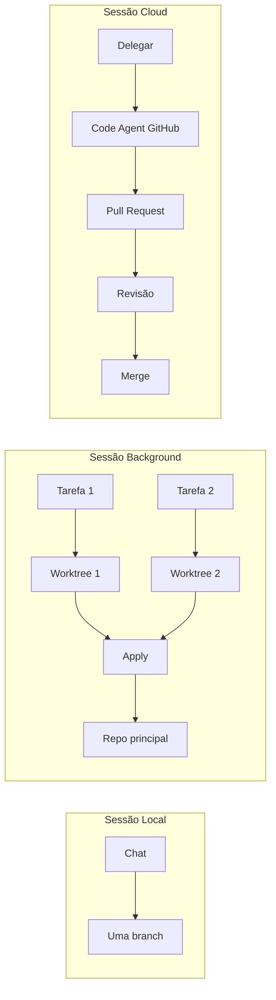

# Trabalhando com agentes de codificação autônoma com Copilot

**Seção:** Aula Ao Vivo  
**Aula:** Agentes de codificação autônoma (GitHub Copilot)  
**Gravação:** [ScreenApp](https://screenapp.io/app/v/lTh9C2Oh8J)  
**Projeto demonstrado:** Express + TypeScript + Prisma + PostgreSQL (blog API)

---

## Resumo executivo

- **Paradigmas de desenvolvimento:** tradicional (manual) → assistido (prompts + IA) → **autônomo** (delegar plano ao agente, execução com mínima intervenção; sempre com revisão humana antes de publicar).
- **Três tipos de sessão no Copilot:** **Local** (chat view, uma branch – não serve para paralelo); **Background** (uma Git worktree por sessão – desenvolvimento paralelo na máquina); **Cloud** (agente roda na nuvem GitHub, cria branch + PR – Code Agent).
- **Git worktree:** “clone” do repositório em outra pasta, com branch própria; permite trabalhar em várias branches ao mesmo tempo sem `git stash`. Cada worktree é isolada; ideal para múltiplos agentes ou múltiplas tarefas em paralelo.
- **Fluxo background:** criar sessão background → Copilot cria worktree → agente desenvolve → Apply (aplica mudanças no repo principal) → merge da branch; ou abrir worktree em nova janela do editor para inspecionar/testar.
- **Cloud Agent:** tarefa delegada roda no GitHub; gera PR em draft; ao finalizar, revisão (humana ou Copilot Reviewer). Integração com MCPs (GitHub, Playwright). Consome Premium requests da assinatura.
- **Boas práticas:** script `prepare.sh` (ou similar) para configurar cada worktree (portas dinâmicas, `.env`, esquema de DB distinto); Copilot Instructions + pasta Instructions com `apply-to` (regex) para economizar tokens; padrão `agents.md` quando o time usa várias ferramentas (Copilot, Claude Code, etc.).

---

## Conceitos-chave (flashcards)

- **P: O que é desenvolvimento autônomo no contexto da aula?**  
  R: Delegar um plano de ação ao agente de IA; ele executa a codificação (ou quase toda) com pouca interferência. Sempre há revisão humana antes de publicar; não é “gerar e publicar direto”.

- **P: Por que sessão Local do Copilot não serve para tarefas paralelas?**  
  R: Todas as sessões usam a mesma branch (current branch). Várias sessões modificando os mesmos arquivos na mesma branch gera conflito e bagunça no controle de versão.

- **P: O que é Git worktree?**  
  R: Comando do Git (desde 2015) que cria um “clone” do repositório em outra pasta, ligado a uma branch específica. Você pode ter N worktrees (N pastas) com N branches diferentes, todas gerenciadas pelo mesmo `.git`.

- **P: Por que preferir worktree a git stash?**  
  R: Stash guarda só arquivos versionados. Arquivos não versionados (`.env`, configs locais) se perdem ou atrapalham. Worktree isola tudo: nova pasta, nova branch, sem afetar o projeto principal.

- **P: O que é sessão Background no Copilot?**  
  R: Cada sessão de agente usa uma worktree só para ela. Várias sessões = várias worktrees = tarefas rodando em paralelo sem conflito de branch. Requer Copilot CLI (prévia).

- **P: O que é Code Agent (Cloud)?**  
  R: Agente que roda na nuvem do GitHub. Cria uma branch e uma PR; desenvolve a tarefa de forma assíncrona; você acompanha no VS Code ou no GitHub. Ao terminar, faz revisão e merge.

- **P: Para que serve o Copilot Reviewer?**  
  R: Revisão automática de código (ex.: em cada PR ou push). Pode rodar CodeQL e análise estática; sugere correções (ex.: não vazar detalhes internos em `catch`). Integrado ao ecossistema GitHub.

- **P: Como economizar tokens com instruções no Copilot?**  
  R: Manter `Copilot Instructions` enxuto; usar pasta `Instructions/` com arquivos como `front-end.instructions.md` e `apply_to` (regex) para que só o contexto relevante seja aplicado (ex.: só pasta `src/front-end`).

---

## Mapa conceitual

```
Desenvolvimento com IA
├── Paradigmas
│   ├── Tradicional (manual)
│   ├── Assistido (prompts + interseções)
│   └── Autônomo (delegar plano → agente executa → humano revisa)
├── Sessões Copilot
│   ├── Local → uma branch, chat view (não paralelo)
│   ├── Background → uma worktree por sessão (paralelo na máquina)
│   └── Cloud → agente na nuvem, branch + PR (Code Agent)
├── Git Worktree
│   ├── Isolamento por pasta + branch
│   ├── prepare.sh (portas, .env, esquema DB)
│   └── Apply → merge no repo principal
└── Revisão
    ├── Humana (PR)
    └── Copilot Reviewer (+ CodeQL)
```

---

## Receita prática: desenvolvimento paralelo com Background

1. **Configurar projeto:** Ter `prepare.sh` (ou equivalente) que rode `npm install`, gere `.env` (portas dinâmicas, esquema distinto se usar mesmo Postgres), e deixe o app rodando.
2. **Garantir Worktree no Copilot:** Usar sessão **Background** (não Local). Cada nova tarefa = nova sessão = nova worktree criada pelo Copilot.
3. **Guidelines no repositório:** Em Copilot Instructions (ou Instructions/ com apply-to), exigir que em worktree o agente rode o script de setup antes de desenvolver (ex.: regra “se `git rev-parse --git-dir` contiver worktrees, rode `./prepare.sh`”).
4. **Delegar tarefas não conflitantes:** Escolher tarefas que não mexam nos mesmos arquivos para evitar conflitos no merge.
5. **Integrar no repo principal:** Na sessão Background, usar **Apply** para trazer as mudanças para o repositório principal; depois `git merge <branch-da-worktree>` na branch desejada. Opcional: abrir worktree em nova janela para testar antes.
6. **Limpar:** Deletar a sessão no Copilot (ele remove a worktree); ou deletar worktree manualmente na ordem correta para não deixar referência quebrada.

---

## Diagrama: fluxo Background vs Cloud



---

## Perguntas de reforço

1. Desenvolvimento autônomo significa publicar em produção sem revisão humana? **Não.** Sempre há revisão; autônomo = agente executa o plano com mínima intervenção, humano aprova e publica.
2. O que o comando `git worktree add ../worktrees/feature-alfa -b FeatureAlpha` faz? Cria uma nova pasta (worktree) com a branch `FeatureAlpha`, separada do diretório atual.
3. Por que usar portas dinâmicas (ex.: 3001, 3002) no prepare de cada worktree? Para não ter dois processos (ou dois containers) na mesma porta (ex.: 3000).
4. O Cloud Agent consome tokens da sua máquina? Não; roda na nuvem e consome da sua assinatura (Premium requests, etc.).
5. Para ver as worktrees no VS Code, qual configuração é necessária? SCM Explorer em modo **single** (não multiple), para o VS Code listar as worktrees do mesmo repositório.
6. O que é o padrão `agents.md`? Um arquivo único que várias ferramentas (Copilot, Claude Code, etc.) leem; times usam `ln -s` de cloud.md ou instructions para `agents.md` para padronizar.
7. Apply na sessão Background faz merge sozinho? Apply traz as alterações da worktree para o repositório principal (arquivos modificados); o merge na branch você faz no repo principal com `git merge <branch>`.

---

## ID Notion

- **Card:** `304962a7-693c-811b-80b3-d0a1012aa911` (Aula Ao Vivo – Trabalhando com agentes de codificação autônoma com Copilot)
