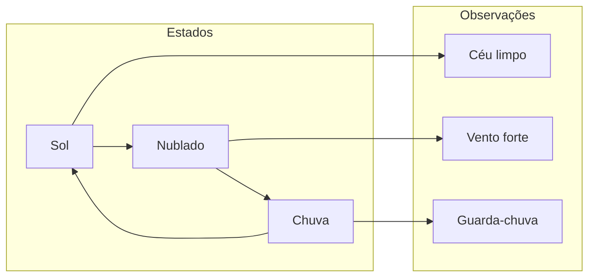

# Cadeias de Markov (HMMs)

**Seção:** Aprofundando na IA e LLM  
**Aula:** Cadeias de Markov (HMMs)  
**Data da aula:** 11/02/2026 (17:12–17:29)  
**Material:** Fundamentos de IA Generativa (PDF p.47–53)

---

## Resumo executivo

- **HMM (Hidden Markov Models)** é evolução dos bigramas: em vez de só pares de palavras, entram **estados ocultos** que governam a geração de observações não diretamente visíveis (ex.: clima inferido por céu nublado, vento, guarda-chuva).
- **Andrei Markov** (São Petersburgo, formado 1888): matemático/estatístico que formalizou as cadeias; teoria de probabilidade e limites.
- **Elementos:** estados ocultos (ex.: sol, chuva, nublado); observações (ex.: céu limpo, vento forte, guarda-chuva aberto); **matriz de transição** entre estados; **matriz de emissão** (probabilidade de observar um evento dado o estado).
- **Algoritmos:** Forward-Backward (probabilidade de uma sequência observada); **Viterbi** (sequência de estados ocultos mais provável); **Baum-Welch/EM** (ajuste de parâmetros com base nos dados).
- **Aplicações:** reconhecimento de fala (estados = fonemas, observações = áudio); POS tagging (estados = categoria gramatical, observações = palavras); biologia computacional (sequências genéticas).
- **Limitações:** próxima observação depende só do estado atual; estado atual só do anterior (dependência de longo prazo fraca); **linearidade** (uma direção, sem ciclos); dados rotulados (rotulagem cara); geração de texto livre limitada.

---

## Conceitos-chave (flashcards)

- **P: O que é estado oculto (hidden state)?**  
  R: Estrutura interna do sistema que não é observada diretamente; você infere por observações (ex.: clima por céu/vento/guarda-chuva).

- **P: O que é matriz de transição?**  
  R: Probabilidade de ir de um estado para outro (ex.: de “sol” para “nublado”); define como o sistema muda de estado ao longo do tempo.

- **P: O que é matriz de emissão?**  
  R: Probabilidade de observar um dado evento a partir de um estado oculto (ex.: probabilidade de “guarda-chuva aberto” dado o estado “chuva”).

- **P: Para que serve o algoritmo Viterbi?**  
  R: Encontrar a sequência de estados ocultos mais provável dada a sequência de observações.

- **P: Por que HMM não captura dependência de longo prazo?**  
  R: Assume que o próximo passo depende só do estado atual e o atual só do anterior; é linear, sem retroalimentação nem ciclos complexos.

- **P: Por que POS tagging se beneficia de HMM?**  
  R: Estados = categorias gramaticais (verbo, substantivo); observações = palavras; a relação palavra–categoria não é “dado direto”, é inferida.

---

## Mapa conceitual

```
Cadeias de Markov (HMM)
├── Elementos
│   ├── Estados ocultos (ex.: sol, chuva, nublado)
│   ├── Observações (ex.: céu limpo, vento, guarda-chuva)
│   ├── Matriz de transição
│   └── Matriz de emissão
├── Algoritmos
│   ├── Forward-Backward → P(sequência observada)
│   ├── Viterbi → sequência de estados mais provável
│   └── Baum-Welch/EM → ajuste de parâmetros
├── Aplicações
│   ├── Reconhecimento de fala
│   ├── POS tagging
│   └── Biologia computacional
└── Limitações
    ├── Linearidade (uma direção)
    ├── Dependência de curto prazo
    ├── Dados rotulados
    └── Geração de texto livre limitada
```

---

## Receita prática (quando usar HMM)

1. **Definir estados ocultos** que expliquem as observações (ex.: clima, fonemas, POS).
2. **Definir observações** mensuráveis ligadas a esses estados.
3. **Estimar ou aprender** matriz de transição e de emissão (ex.: Baum-Welch com dados).
4. **Usar Forward-Backward** para P(sequência) ou **Viterbi** para decodificar a sequência de estados mais provável.
5. **Evitar** para texto longo ou conversa livre; preferir para sequências com estrutura probabilística clara e dependências de curto prazo.

---

## Diagrama



---

## Perguntas de reforço

1. HMM substitui bigramas em que sentido? Introduz estados ocultos e contexto global, não só pares de palavras.
2. O que Forward-Backward calcula? A probabilidade de uma sequência observada ocorrer.
3. Por que “linearidade” é limitação? O modelo vai só numa direção, sem ciclos nem retroalimentação como em redes neurais.
4. O que é POS tagging no contexto de HMM? Estados = categorias gramaticais; observações = palavras; inferência da categoria a partir da palavra/contexto.
5. Para geração de texto estilo GPT, HMM é adequado? Não; foi pensado para sequências com estrutura probabilística clara e curta, não para texto livre longo.

---

## ID Notion

- **Card:** `304962a7-693c-8121-9095-d2ce0de471a3`
