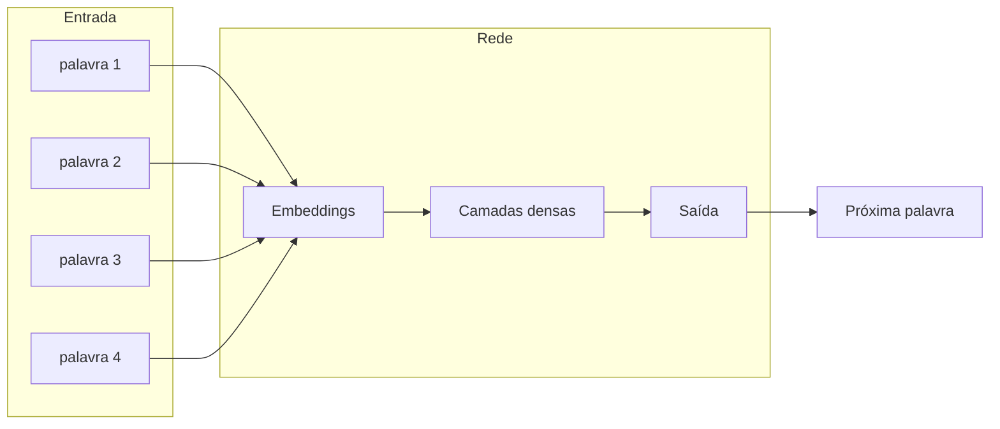

# Redes Neurais Profundas

**Seção:** Aprofundando na IA e LLM  
**Aula:** Redes Neurais Profundas  
**Data da aula:** 11/02/2026 (17:31–17:46)  
**Material:** Fundamentos de IA Generativa (PDF p.54–59)

---

## Resumo executivo

- **Redes neurais profundas (DNNs)** simulam redes biológicas com **muitas camadas**; entrada passa por uma cadeia longa de transformações até a saída. “Profundo” = número de camadas.
- **Contexto histórico:** Anos 80–90; crescimento de dados (internet, redes sociais, sensores) e de poder computacional (GPUs) permitiram voltar a escalar redes neurais e dar novo fôlego à IA.
- **Linguagem natural:** Palavras não entram direto na rede; usam-se **embeddings** (representação vetorial em espaço contínuo de alta dimensão). Palavras semelhantes ficam próximas; exemplos: GloVe, BERT, GPT.
- **Feedforward:** Fluxo unidirecional (entrada → camadas → saída); não há “volta” nem memória do passado.
- **Janelas de contexto fixo:** Ex.: janela de 4 palavras (“o cachorro está no”) para prever a próxima (“jardim”); ajuda coerência local, mas contexto continua limitado.
- **Limitações:** Ordem da sequência difícil (ex.: “cachorro mordeu homem” vs “homem mordeu cachorro” — vetores podem ficar próximos e trocar a ordem); falta de memória; dependências além da janela (ex.: parágrafo inteiro) se perdem.

---

## Conceitos-chave (flashcards)

- **P: O que é embedding no contexto de DNN para linguagem?**  
  R: Representação vetorial de uma palavra em espaço contínuo de alta dimensão; palavras com significado parecido ficam próximas no espaço.

- **P: Por que “profundo” em rede neural profunda?**  
  R: Refere-se ao número de camadas; muitas camadas permitem transformações e combinações mais complexas entre entrada e saída.

- **P: O que é rede feedforward?**  
  R: Fluxo de dados em uma só direção (entrada → camadas → saída), sem ciclos nem memória do processamento anterior.

- **P: O que é janela de contexto fixo?**  
  R: Número fixo de palavras (ex.: 4) usadas para prever a próxima; limita o contexto e não resolve dependências longas.

- **P: Por que “cachorro mordeu o homem” e “homem mordeu o cachorro” podem ser confundidas?**  
  R: Em representação vetorial (ex.: soma de embeddings), o resultado pode ser muito parecido; a rede não “enxerga” bem a ordem só com feedforward e janela fixa.

- **P: Qual limitação das DNNs para diálogo ou tradução longa?**  
  R: Falta de memória: o modelo não acessa o que foi processado antes além da janela; difícil manter coerência em conversa ou texto longo.

---

## Mapa conceitual

```
Redes Neurais Profundas (DNN)
├── Contexto (80–90)
│   ├── Mais dados (internet, sensores)
│   └── Mais poder (GPUs)
├── Linguagem natural
│   ├── Embeddings (vetores; GloVe, BERT, GPT)
│   └── Palavras semelhantes → vetores próximos
├── Arquitetura
│   ├── Feedforward (unidirecional)
│   └── Janelas de contexto fixo
├── Aplicações
│   └── Previsão da próxima palavra, modelagem de linguagem
└── Limitações
    ├── Ordem da sequência difícil
    ├── Falta de memória
    └── Contexto limitado (janela fixa)
```

---

## Receita prática

1. **Representar palavras** como embeddings (pré-treinados ou treinados no seu corpus).
2. **Definir janela de contexto** (ex.: 4 palavras) para prever a próxima.
3. **Montar rede feedforward** (entrada = concatenação/soma dos vetores da janela → camadas densas → saída).
4. **Treinar** com sequências de texto; avaliar coerência e limite de contexto.
5. **Não esperar** memória de longo prazo nem ordem fina sem mecanismos adicionais (ex.: RNN, atenção).

---

## Diagrama



---

## Perguntas de reforço

1. O que mudou nos anos 80–90 para as DNNs? Mais dados e GPUs permitiram treinar redes com muitas camadas.
2. Por que não colocamos a palavra “crua” na rede? Precisamos de representação numérica; embeddings convertem palavra em vetor.
3. Janela de 4 palavras resolve dependência em um parágrafo inteiro? Não; só captura contexto local.
4. Feedforward considera o que foi processado antes? Não; não há memória, só o bloco de entrada atual.
5. Qual o próximo passo após DNN para melhorar coerência? Redes com memória (RNN, LSTM, GRU) e depois atenção/Transformers.

---

## ID Notion

- **Card:** `304962a7-693c-81cd-949b-e5b6d1036f96`
