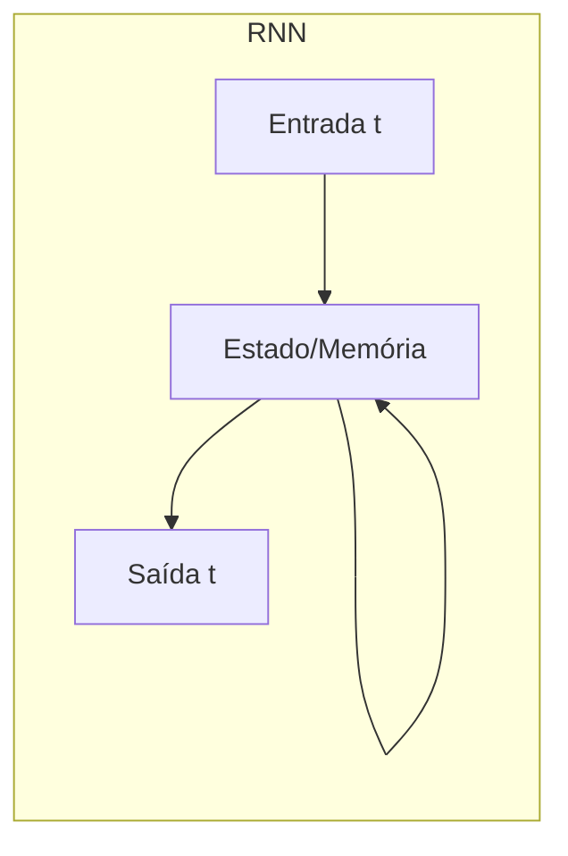

# RNN (Redes Neurais Recorrentes)

**Seção:** Aprofundando na IA e LLM  
**Aula:** RNN (Redes Neurais Recorrentes)  
**Data da aula:** 11/02/2026 (17:47–18:03)  
**Material:** Fundamentos de IA Generativa (PDF p.60–62)

---

## Resumo executivo

- **RNNs** foram projetadas para **dados sequenciais** (texto, áudio, série temporal, vídeo). A saída em um instante depende da **entrada atual e do estado em memória** (processamento passado), permitindo coerência (ex.: "cachorro mordeu o homem" vs "homem mordeu o cachorro").
- **Ideia central:** Guardar em "memória" o que já foi processado e usar isso no próximo passo; fluxo ainda sequencial (uma palavra de cada vez).
- **Problemas graves:** **Desvanecimento do gradiente** (sequências longas: sinal do início some, a rede "esquece"); **explosão do gradiente** (instabilidade no treino); **processamento sequencial** (difícil paralelizar, treino lento).
- **LSTM (Long Short-Term Memory):** Portas de **entrada**, **esquecimento** e **saída** controlam o que entra na memória, o que é apagado e o que é repassado; reduz desvanecimento/explosão, mas não elimina.
- **GRU (Gated Recurrent Unit):** Versão simplificada da LSTM (porta de entrada e de esquecimento unificadas); menos parâmetros, treino mais rápido, desempenho comparável em muitas tarefas.
- **Limitações que permanecem:** Ainda sequenciais (paralelização limitada); contexto muito longo ainda difícil; escalar para vocabulário e dados enormes é custoso.

---

## Conceitos-chave (flashcards)

- **P: Por que RNN melhora em "cachorro mordeu o homem"?**  
  R: A memória guarda o que já foi processado; ao gerar "mordeu" e "homem", o modelo acessa quem fez a ação (cachorro), mantendo ordem e coerência.

- **P: O que é desvanecimento do gradiente?**  
  R: Em sequências longas, os gradientes que voltam no tempo ficam muito pequenos; a rede "esquece" o início da sequência e perde rastreabilidade.

- **P: O que é explosão do gradiente?**  
  R: O contrário: gradientes ficam muito grandes ao longo do tempo, gerando instabilidade no treinamento.

- **P: O que as portas da LSTM fazem?**  
  R: Entrada: o que entra na memória; esquecimento: o que é apagado; saída: o que é repassado adiante. Assim a rede retém o relevante e descarta ruído.

- **P: GRU em relação à LSTM?**  
  R: Arquitetura mais simples (menos portas/parâmetros); treino mais rápido; desempenho muitas vezes comparável à LSTM.

- **P: Por que RNN não paraleliza bem?**  
  R: Cada passo depende do anterior; é inerentemente sequencial, então não dá para processar todos os instantes ao mesmo tempo como em feedforward puro.

---

## Mapa conceitual

```
RNN (Redes Neurais Recorrentes)
├── Ideia
│   ├── Dados sequenciais (texto, áudio, série)
│   ├── Saída = f(entrada atual, estado/memória)
│   └── Memória do processamento passado
├── Problemas
│   ├── Desvanecimento do gradiente
│   ├── Explosão do gradiente
│   └── Processamento sequencial (lento)
├── Evoluções
│   ├── LSTM (portas entrada, esquecimento, saída)
│   └── GRU (portas unificadas, mais simples)
├── Aplicações
│   ├── Tradução automática
│   ├── Geração de texto
│   ├── Reconhecimento de fala
│   └── Análise de sentimento
└── Limitações restantes
    ├── Ainda sequencial
    ├── Contexto muito longo difícil
    └── Escalabilidade
```

---

## Receita prática

1. **Usar RNN/LSTM/GRU** quando a ordem e o contexto sequencial importam (texto, áudio, séries).
2. **Monitorar gradientes** (norma, clipping) para evitar explosão e desvanecimento.
3. **Para sequências longas,** preferir LSTM ou GRU e considerar truncar ou segmentar se a memória ainda for insuficiente.
4. **Avaliar trade-off:** GRU mais rápido e simples; LSTM mais expressiva em alguns cenários.
5. **Próximo passo** para contexto muito longo e paralelização: arquiteturas com atenção (Transformers).

---

## Diagrama



---

## Perguntas de reforço

1. O que a RNN guarda que a DNN feedforward não guarda? Estado (memória) do processamento anterior.
2. Desvanecimento do gradiente afeta qual tipo de dependência? Dependências de longo prazo; a rede perde o sinal do início da sequência.
3. Por que LSTM/GRU ajudam? Controlam o que entra e sai da memória, reduzindo perda ou explosão do gradiente.
4. RNN processa a sequência em paralelo? Não; cada passo depende do anterior, então o processamento é sequencial.
5. Qual evolução permite processar todos os tokens em paralelo e capturar dependências longas? Transformers (auto-atenção).

---

## Resumo em uma frase

RNNs processam dados sequenciais com memória do passado; LSTM e GRU mitigam desvanecimento/explosão do gradiente; o Transformer supera RNNs com auto-atenção e processamento paralelo.

---

## ID Notion

- **Card:** `304962a7-693c-81d6-a763-daffcbefb13c`
