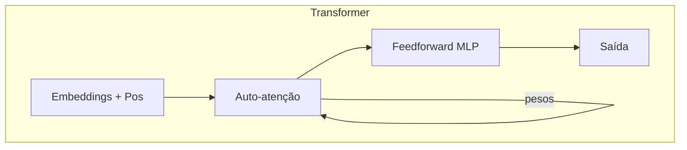

# Aprofundando em LLM — Transformers e Attention

**Seção:** Aprofundando na IA e LLM  
**Aula:** Aprofundando em LLM / Transformers e Attention  
**Data da aula:** 11/02/2026 (18:03–18:20)  
**Material:** Fundamentos de IA Generativa (PDF p.63–64)

---

## Resumo executivo

- **Objetivo:** Mergulho técnico na arquitetura dos LLMs — como funcionam por dentro.
- **Paper “Attention Is All You Need” (2017, Google):** Proposta da arquitetura **Transformer**, que **elimina a necessidade de RNNs** e introduz o mecanismo de **auto-atenção (self-attention)**. Marco para IA generativa.
- **Problemas até então:** Dependência de longo prazo difícil (desde Markov, bigramas, RNN); incapacidade de **paralelizar** o processamento (treino lento).
- **Auto-atenção:** Cada token (palavra) é comparado com **todos os outros** da sequência e recebe **pesos de importância**; palavras distantes podem ter peso alto se a relação for forte (ex.: “O livro que o João **leu** era interessante” — “leu” conecta-se a “livro” e “João”).
- **Componentes principais:** (1) **Camada de auto-atenção** (cada token comparado a todos para calcular pesos); (2) **Camadas feedforward (MLP)** por token (não linearidade); (3) **Positional encoding** (posição de cada token na sequência, pois não há processamento sequencial como na RNN).
- **Benefícios:** Processamento **paralelo** de todos os tokens (treino mais rápido); captura de **dependências longas** sem degradação do gradiente; **escalabilidade** (bilhões de parâmetros).
- **Impacto:** Base de BERT, GPT, T5, LLaMA; visão (ViT); multimodalidade (ex.: GPT-4 com texto, imagem, áudio).

---

## Conceitos-chave (flashcards)

- **P: O que substitui a RNN no Transformer?**  
  R: A auto-atenção: cada posição “olha” para todas as outras e usa os pesos para compor sua representação.

- **P: O que é auto-atenção (self-attention)?**  
  R: Mecanismo em que cada token da sequência é comparado com todos os outros; calcula-se a importância relativa de cada um para formar uma nova representação do token.

- **P: Por que positional encoding é necessário no Transformer?**  
  R: Como não há processamento sequencial (tudo pode ser processado em paralelo), é preciso informar a posição de cada token na sequência para preservar a ordem.

- **P: Como o Transformer evita o problema de “homem mordeu o cachorro”?**  
  R: Com pesos de atenção: o modelo pode dar mais peso a “cachorro” ao interpretar “mordeu”, mantendo sujeito e ação corretos mesmo à distância.

- **P: Qual a vantagem de processar todos os tokens em paralelo?**  
  R: Treinamento muito mais rápido; aproveita bem GPU/TPU e permite escalar para modelos enormes.

- **P: Quais modelos são baseados em Transformer?**  
  R: BERT, GPT, T5, LLaMA, ViT (visão), e modelos multimodais como GPT-4.

---

## Mapa conceitual

```
Aprofundando em LLM — Transformers e Attention
├── Paper: Attention Is All You Need (2017)
├── Mecanismo central: auto-atenção
│   ├── Cada token comparado a todos
│   ├── Pesos de importância
│   └── Conexões à distância (ex.: livro–leu–João)
├── Componentes
│   ├── Camada de auto-atenção
│   ├── Camadas feedforward (MLP)
│   └── Positional encoding
├── Benefícios
│   ├── Processamento paralelo
│   ├── Dependências longas sem degradação do gradiente
│   └── Escalabilidade (bilhões de parâmetros)
└── Impacto
    ├── BERT, GPT, T5, LLaMA
    ├── ViT (visão)
    └── Multimodalidade (GPT-4)
```

---

## Receita prática

1. **Entender o problema:** Sequências onde ordem e relações à distância importam (linguagem, código, etc.).
2. **Auto-atenção:** Para cada posição, calcular scores com todas as posições, normalizar (ex.: softmax) e usar como pesos para combinar as representações.
3. **Positional encoding:** Somar (ou concatenar) um vetor de posição aos embeddings para preservar ordem.
4. **Empilhar** blocos de atenção + feedforward; treinar com dados em escala.
5. **Reuso:** Usar modelos pré-treinados (BERT, GPT, etc.) e fine-tune ou prompt para sua tarefa.

---

## Diagrama



---

## Perguntas de reforço

1. O que o paper “Attention Is All You Need” propôs? Arquitetura Transformer sem RNNs, usando apenas auto-atenção (e feedforward, positional encoding).
2. Por que “O livro que o João leu era interessante” ilustra atenção? “Leu” precisa conectar-se a “livro” e “João” mesmo com palavras no meio; a atenção atribui peso alto a esses tokens.
3. Positional encoding resolve qual problema? A ordem da sequência, já que o Transformer processa todos os tokens em paralelo e não tem ordem inerente.
4. Transformer sofre desvanecimento do gradiente como RNN? Em geral não da mesma forma; as conexões diretas entre posições permitem gradientes estáveis em dependências longas.
5. O que é ViT? Vision Transformer: uso da arquitetura Transformer para visão computacional (patches de imagem como “tokens”).

---

## ID Notion

- **Card:** `304962a7-693c-81d3-9978-ec9172ddc392`
