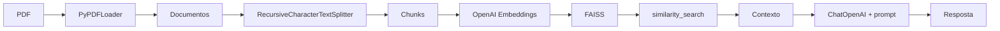

# Bloco 1 — RAG com LangChain e FAISS

Prática de RAG (Retrieval-Augmented Generation): carregar PDF, gerar embeddings e consultar com perguntas em linguagem natural.

## Estrutura

| Arquivo                 | Descrição                                                                                                                                                                                                                 |
| ----------------------- | ------------------------------------------------------------------------------------------------------------------------------------------------------------------------------------------------------------------------- |
| `app.py`                | Pipeline principal: carrega PDF (PyPDFLoader), divide em chunks (RecursiveCharacterTextSplitter), gera embeddings (OpenAI), persiste em FAISS; função `retrieval(pergunta)` para busca semântica e resposta com contexto. |
| `grafico_embeddings.py` | Script extra: gera gráfico 2D dos embeddings (PCA) e salva `grafico_embeddings.png`.                                                                                                                                      |
| `visualizar_faiss.py`   | Script extra: lista todos os chunks do índice FAISS no terminal.                                                                                                                                                          |
| `requirements.txt`      | Dependências (langchain, openai, faiss, etc.).                                                                                                                                                                            |
| `Perceptron.pdf`        | PDF de exemplo (colocar na raiz; link no README do Bootcamp).                                                                                                                                                             |

## Fluxo: dados → embeddings → FAISS → busca



1. **Carregar:** `PyPDFLoader` lê o PDF e produz uma lista de documentos (páginas).
2. **Dividir:** `RecursiveCharacterTextSplitter` (chunk_size=500, overlap=100) gera chunks.
3. **Embeddings:** `OpenAIEmbeddings` transforma cada chunk em vetor.
4. **Índice:** FAISS armazena os vetores em `banco_faiss/` (cria ou carrega e adiciona).
5. **Busca:** `retrieval(pergunta)` carrega o FAISS, faz `similarity_search(pergunta, k=4)`, monta o contexto e invoca a chain (prompt + LLM) para gerar a resposta.

## Execução

```bash
# Na raiz do Bootcamp ou em Bloco 1
python -m venv .venv
source .venv/bin/activate
pip install -r requirements.txt
cp ../.env.example ../.env   # e defina OPENAI_API_KEY

# Coloque Perceptron.pdf na pasta Bloco 1 (ou ajuste caminho em app.py)
python app.py
```

Scripts extras (após rodar `app.py` e gerar `banco_faiss/`):

```bash
python grafico_embeddings.py   # Salva grafico_embeddings.png
python visualizar_faiss.py     # Exibe os chunks no terminal
```

## Referência

- Notion: [RAG - Arquivos da aula](https://grizzly-amaranthus-f6a.notion.site/RAG-Arquivos-da-aula-2fb6cf8ea89f80f58351d938fcf8ab05)
- Bloco 2 reutiliza o conceito de RAG (documentos, embeddings, retrieval) no projeto Jury AI (Django).
