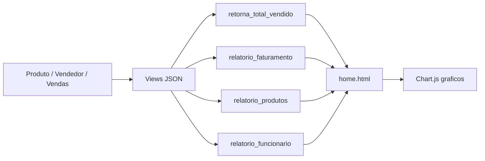

# Dashboard Django + Chart.js (amostra)

Projeto de amostra do Bootcamp Pythonando: dashboard de vendas com Django e Chart.js. Nao faz parte do Jury AI; e uma amostra independente do material do bootcamp.

Referencia: `Apostilas e Materiais de Cursos/[Pythonando] Bootcamp Programacao Web + IA/Dashboard_django_chart.js-master`.

## Funcionalidades

- Modelos: Produto, Vendedor, Vendas.
- Tela unica com graficos: faturamento total, faturamento mensal (bar), despesas (line, dados fixos), produtos mais vendidos (doughnut), funcionarios do mes (polarArea).
- APIs JSON: `retorna_total_vendido`, `relatorio_faturamento`, `relatorio_produtos`, `relatorio_funcionario`.

## Setup

```bash
cd amostras/dashboard-django-chartjs
python -m venv .venv
source .venv/bin/activate
pip install -r requirements.txt
cp .env.example .env   # opcional: SECRET_KEY
python manage.py migrate
python manage.py runserver
```

Acesse http://127.0.0.1:8000/ e cadastre produtos/vendedores/vendas pelo admin (http://127.0.0.1:8000/admin/) para ver os graficos preenchidos.

## Estrutura

- `dashboard/` — settings, urls.
- `minha_dashboard/` — models (Produto, Vendedor, Vendas), views (home + 4 endpoints JSON), templates.
- `templates/` — base.html, static (css, js com Chart.js).

## Fluxo (dados → views → Chart.js)


